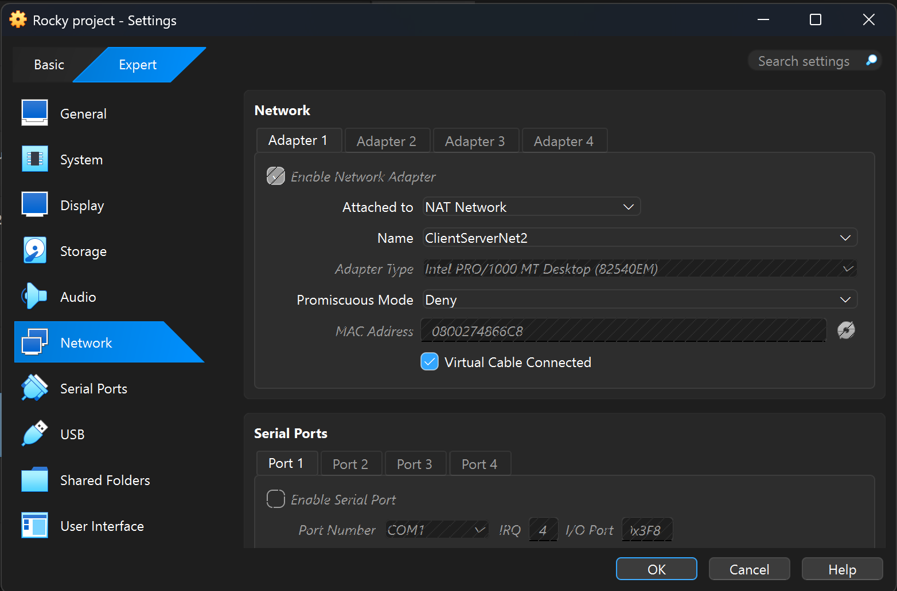
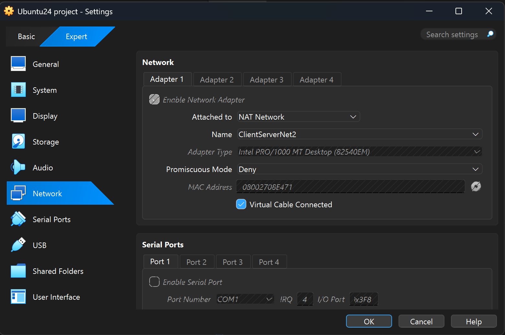
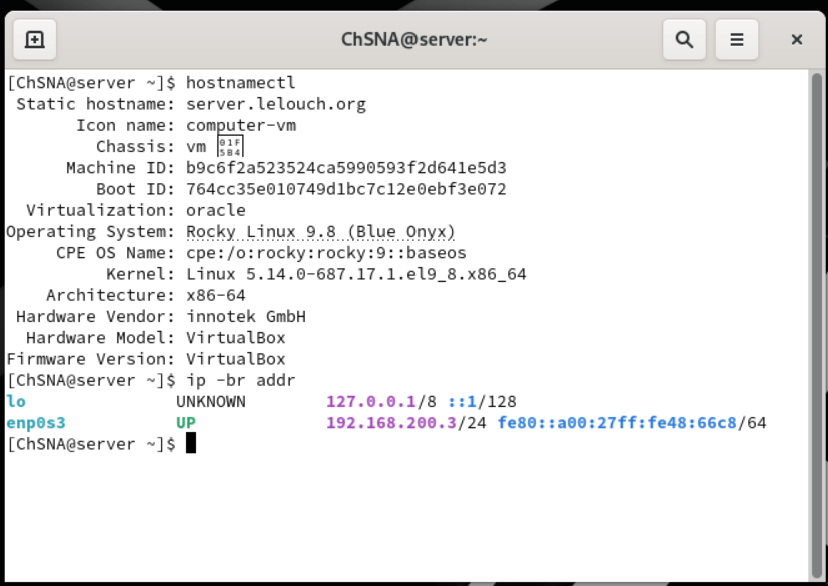
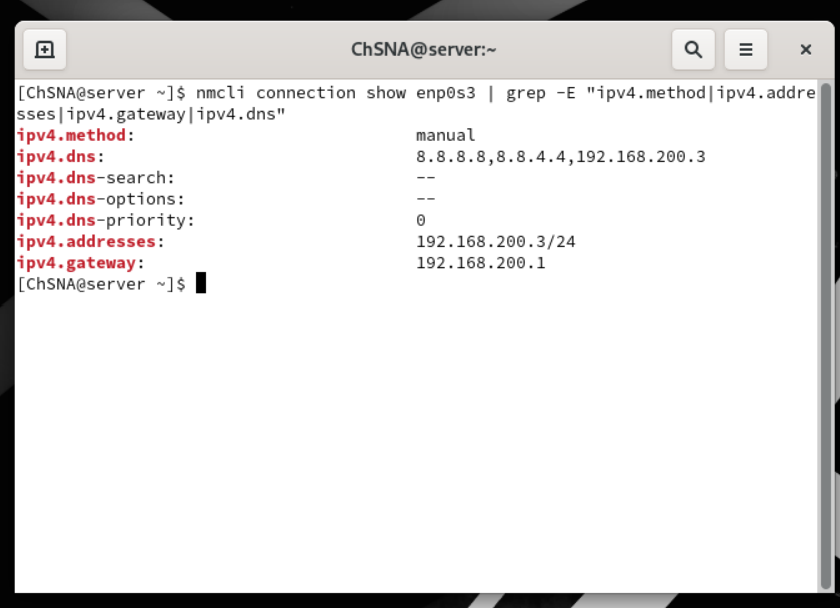
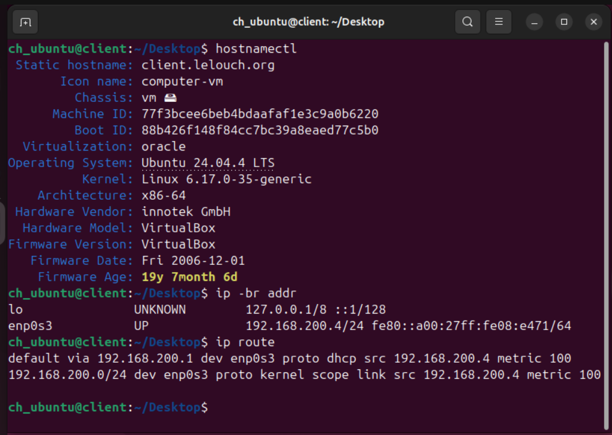
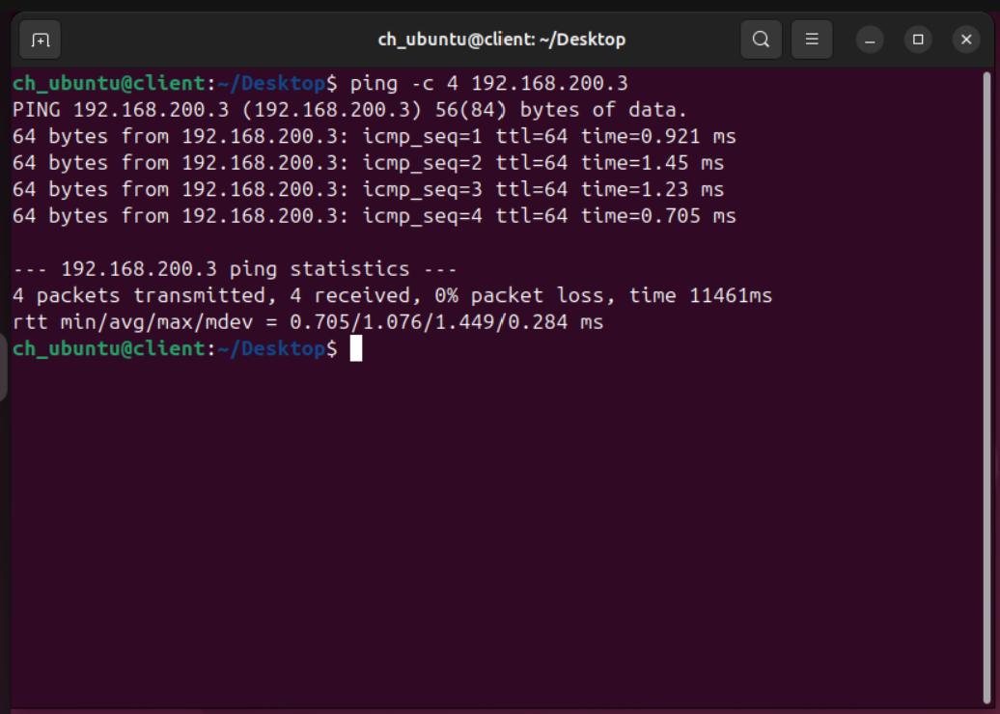

# Lab Environment Setup

## Objective

The objective of this section is to prepare the virtual lab environment before configuring the main Linux network services.

This lab uses two virtual machines:

- Rocky Linux Server
- Ubuntu Client

The Rocky Linux machine acts as the main server for services such as DNS, DHCP, FTP, NFS, Apache, Mail, SSH and Honeypot.

The Ubuntu machine acts as the client used to test connectivity and service access.

## VirtualBox Network Configuration

Both virtual machines were connected to the same VirtualBox NAT Network.

| Setting | Value |
|---|---|
| Network Mode | NAT Network |
| Network Name | ClientServerNet2 |
| Network Subnet | 192.168.200.0/24 |

### Rocky Server VirtualBox Network



### Ubuntu Client VirtualBox Network



## Virtual Machines

| Machine | Role | Operating System | Hostname | IP Address |
|---|---|---|---|---|
| Rocky Server | Main network services server | Rocky Linux 9.8 | server.lelouch.org | 192.168.200.3/24 |
| Ubuntu Client | Testing client machine | Ubuntu 24.04.4 LTS | client.lelouch.org | 192.168.200.4/24 |

## Rocky Server Network Configuration

The Rocky Linux server was configured with a static IP address because it will host the main network services.

A static IP address is required on the server to make sure that services such as DNS, DHCP, FTP, NFS, Apache, Mail and SSH remain reachable using the same address.

The server was configured with the following network information:

| Setting | Value |
|---|---|
| Interface | enp0s3 |
| IP Address | 192.168.200.3/24 |
| Gateway | 192.168.200.1 |
| DNS | 8.8.8.8, 8.8.4.4, 192.168.200.3 |
| IPv4 Method | Manual |

### Rocky Hostname and IP Address



### Rocky Static IP Verification

The static IP configuration was verified using `nmcli`.

```bash
nmcli connection show enp0s3 | grep -E "ipv4.method|ipv4.addresses|ipv4.gateway|ipv4.dns"
```



## Ubuntu Client Network Configuration

The Ubuntu client currently receives an IP address dynamically.

This is intentional because DHCP will be configured later on the Rocky Linux server. After the DHCP service is configured, the Ubuntu client will be used to test automatic IP address assignment from the Rocky server.

For now, Ubuntu receives an IP address from the VirtualBox NAT Network DHCP service.

| Setting | Value |
|---|---|
| Interface | enp0s3 |
| Current IP Address | 192.168.200.4/24 |
| Gateway | 192.168.200.1 |
| IPv4 Method | DHCP |



## Connectivity Test

Connectivity between the Ubuntu client and the Rocky server was tested using the `ping` command.

```bash
ping -c 4 192.168.200.3
```



## Result

The Ubuntu client successfully reached the Rocky Linux server with 0% packet loss.

This confirms that both virtual machines are connected to the same VirtualBox NAT Network and can communicate with each other.

## Notes

This section covers the initial lab environment setup before configuring the main network services.

The next section will focus on DNS server configuration.
