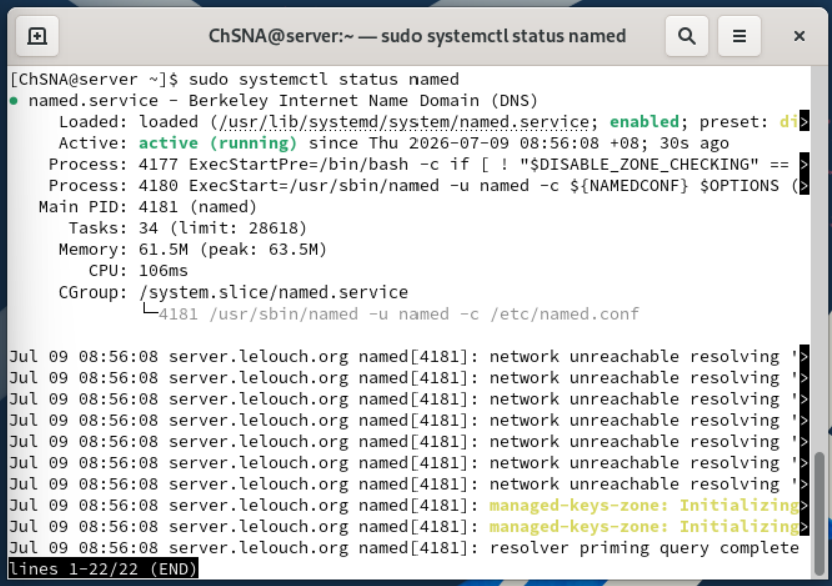
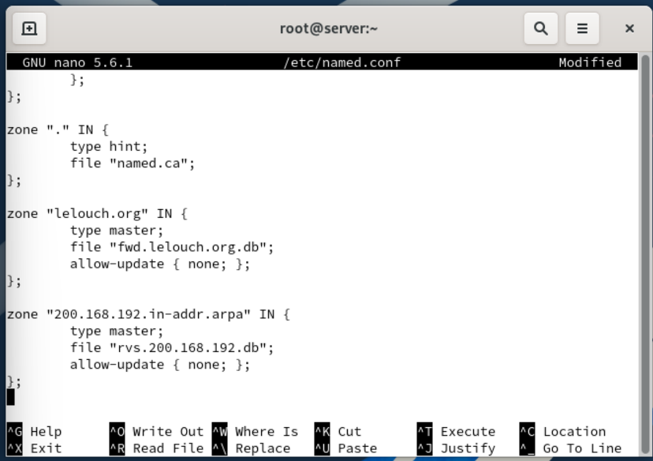
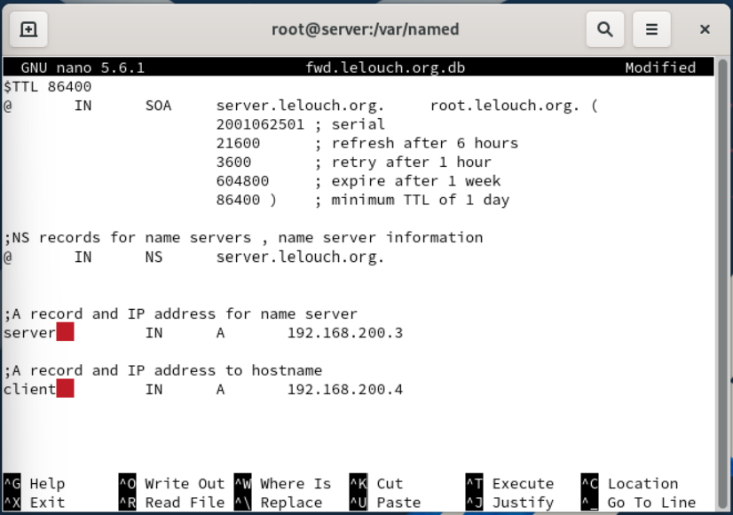
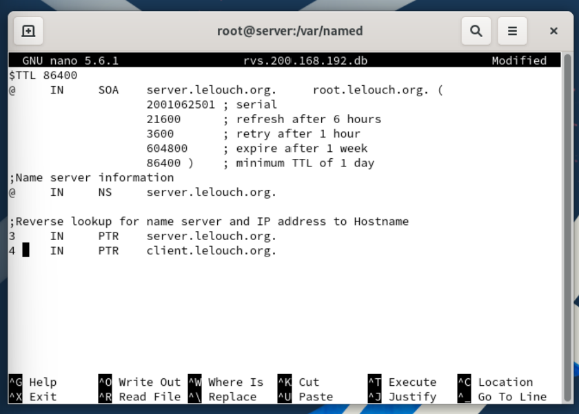
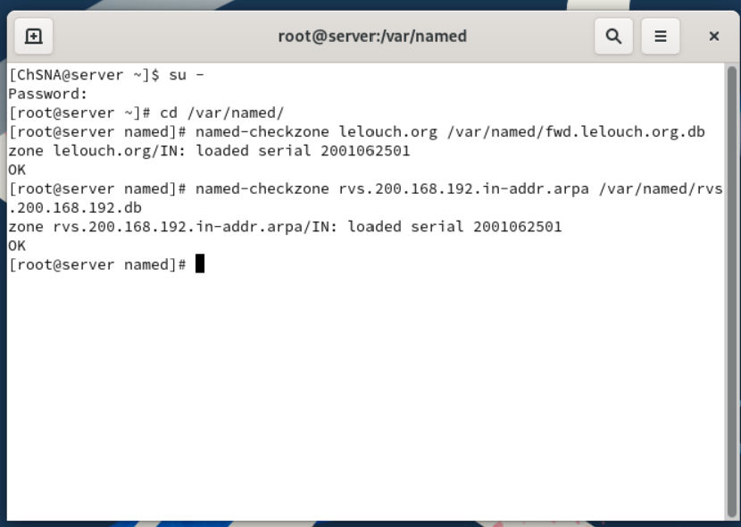
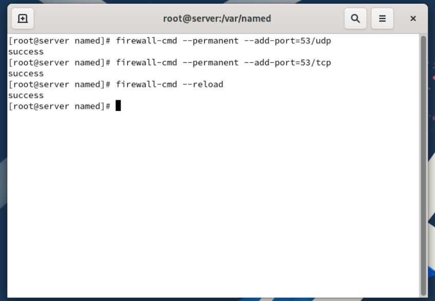
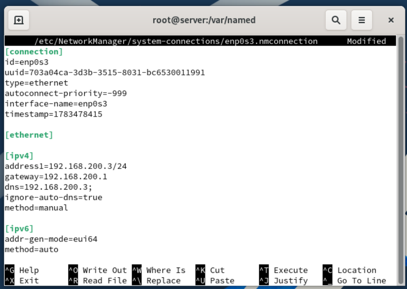
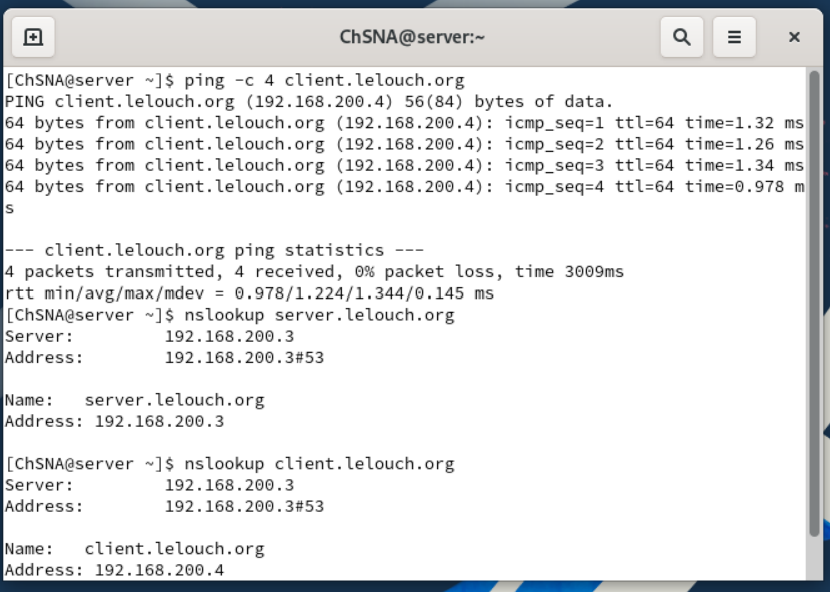
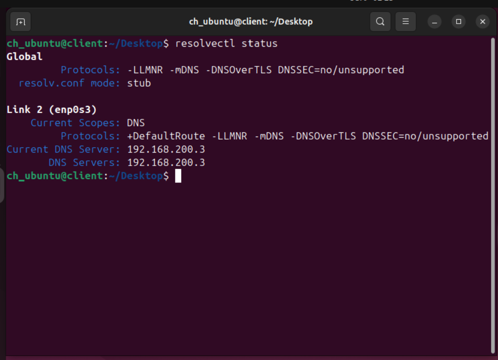
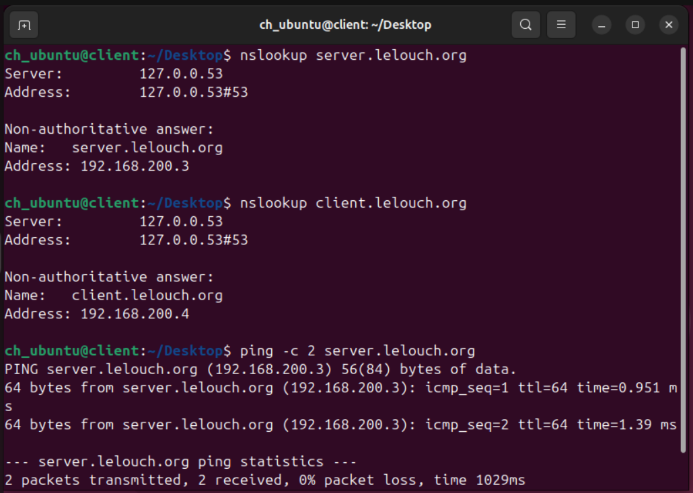

# DNS Server Configuration

## Objective

The objective of this section is to configure a local DNS server using BIND on Rocky Linux.

The DNS server will resolve local hostnames inside the lab network.

## Lab Information

| Machine | Role | Hostname | IP Address |
|---|---|---|---|
| Rocky Server | DNS Server | server.lelouch.org | 192.168.200.3 |
| Ubuntu Client | DNS Client | client.lelouch.org | 192.168.200.4 |

## DNS Configuration Overview

BIND was installed and configured on the Rocky Linux server.

The DNS configuration includes:

- Forward lookup zone
- Reverse lookup zone
- DNS service validation
- Firewall rule for DNS traffic
- DNS testing from both Rocky Server and Ubuntu Client

## Configuration Files

The DNS configuration files are available in the `config/dns/` folder.

| File | Purpose |
|---|---|
| [named.conf](../config/dns/named.conf) | Main BIND DNS configuration file |
| [fwd.lelouch.org.db](../config/dns/fwd.lelouch.org.db) | Forward lookup zone file |
| [rvs.200.168.192.db](../config/dns/rvs.200.168.192.db) | Reverse lookup zone file |

## BIND Service Status

The `named` service was enabled and started on the Rocky Linux server.

```bash
sudo systemctl status named
```



## named.conf Zone Configuration

The main BIND configuration file was updated with two DNS zones:

- `lelouch.org`
- `200.168.192.in-addr.arpa`

The first zone is used for forward DNS resolution.  
The second zone is used for reverse DNS resolution.



## Forward Lookup Zone

The forward lookup zone maps hostnames to IP addresses.

Example:

```text
server.lelouch.org → 192.168.200.3
client.lelouch.org → 192.168.200.4
```



## Reverse Lookup Zone

The reverse lookup zone maps IP addresses back to hostnames.

Example:

```text
192.168.200.3 → server.lelouch.org
192.168.200.4 → client.lelouch.org
```



## Zone Validation

The forward and reverse zone files were checked using `named-checkzone`.

```bash
named-checkzone lelouch.org /var/named/fwd.lelouch.org.db
named-checkzone 200.168.192.in-addr.arpa /var/named/rvs.200.168.192.db
```

Both zone files returned `OK`, confirming that the DNS zone files were valid.



## Firewall Configuration

DNS uses port 53. The firewall was configured to allow DNS traffic using both UDP and TCP.

```bash
firewall-cmd --permanent --add-port=53/udp
firewall-cmd --permanent --add-port=53/tcp
firewall-cmd --reload
```



## Rocky Server DNS Settings

The Rocky Linux server was configured to use itself as the DNS server.

```text
DNS Server: 192.168.200.3
```



## DNS Testing on Rocky Server

DNS resolution was tested from the Rocky server using `nslookup`.

```bash
nslookup server.lelouch.org
nslookup client.lelouch.org
```

The server successfully resolved both hostnames.



## Ubuntu Client DNS Configuration

The Ubuntu client was configured to use the Rocky Linux server as its DNS server.

The `resolvectl status` command confirmed that Ubuntu was using:

```text
DNS Server: 192.168.200.3
```



## DNS Testing on Ubuntu Client

DNS resolution was tested from the Ubuntu client using `nslookup` and `ping`.

```bash
nslookup server.lelouch.org
nslookup client.lelouch.org
ping -c 2 server.lelouch.org
```

The Ubuntu client successfully resolved and reached the Rocky server using its FQDN.



## Result

The DNS server was configured successfully.

The Rocky Linux server can resolve local DNS records, and the Ubuntu client can use the Rocky server as its DNS resolver.

The DNS configuration is working correctly for both forward and reverse lookup zones.
