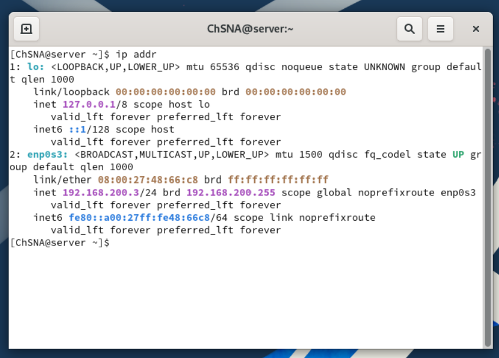
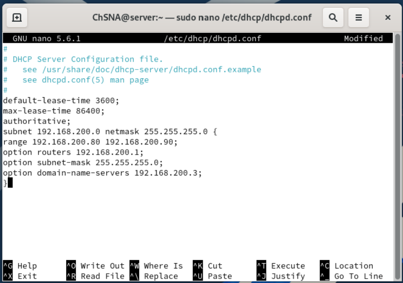
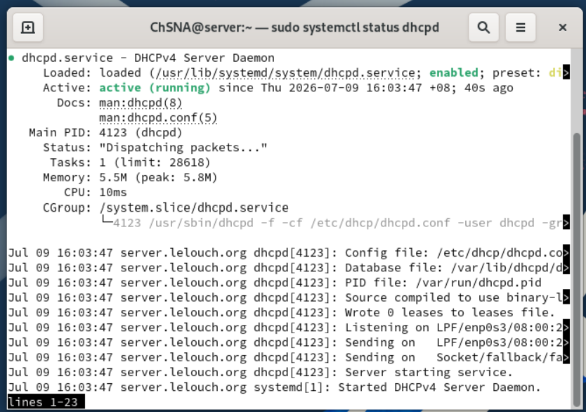
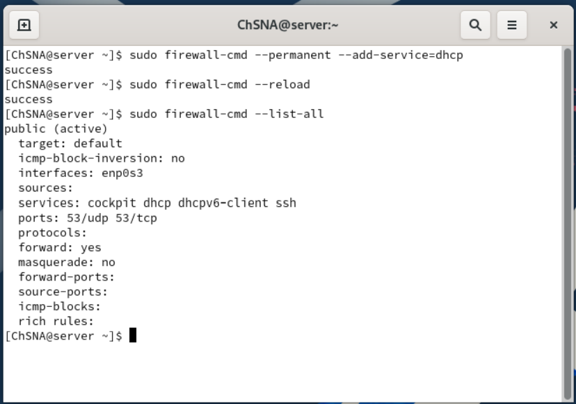
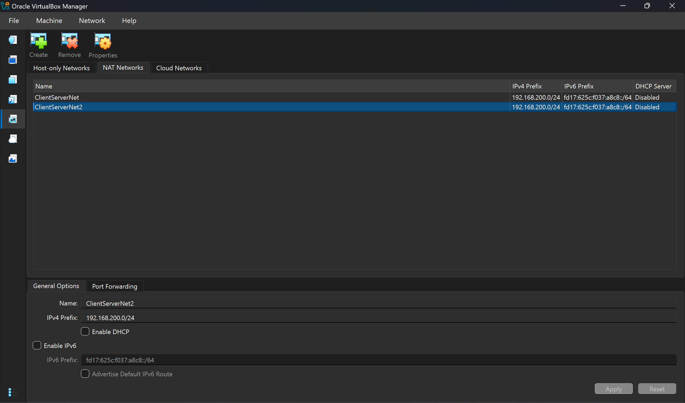
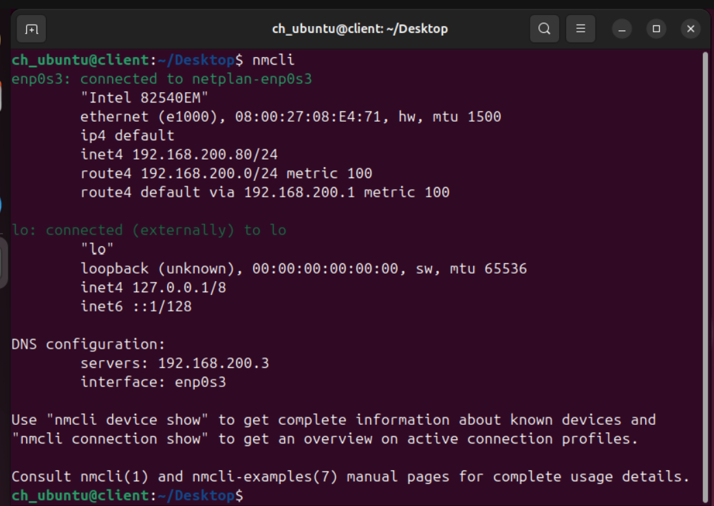
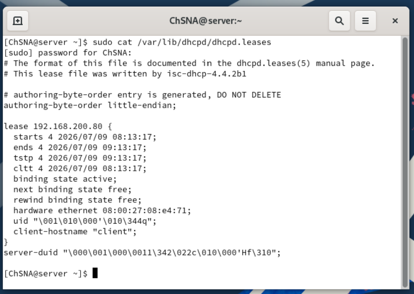
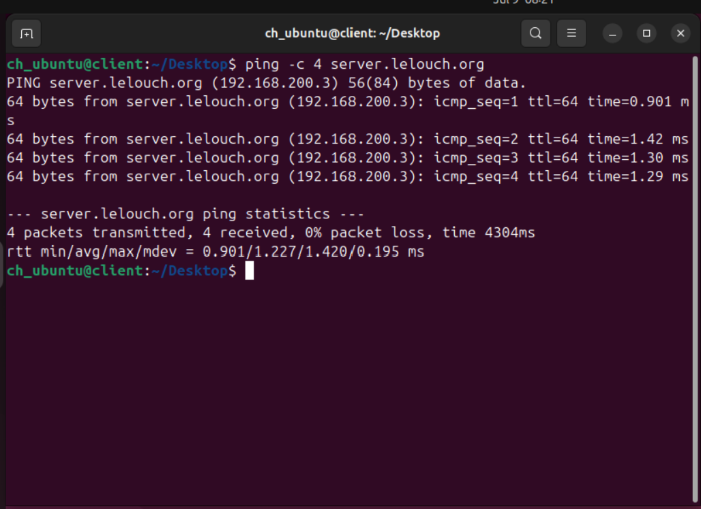

# DHCP Server Configuration

## Objective

The objective of this section is to configure the Rocky Linux server as a DHCP server and verify that the Ubuntu client receives its network configuration automatically from Rocky.

DHCP, or Dynamic Host Configuration Protocol, is used to automatically provide network settings to client machines.

Instead of manually configuring the Ubuntu client with an IP address, gateway, subnet mask, and DNS server, the Rocky DHCP server assigns these values automatically.

The DHCP server provides the client with:

- IP address
- Subnet mask
- Default gateway
- DNS server
- Lease duration

## Lab Information

| Machine | Role | Hostname | IP Address |
|---|---|---|---|
| Rocky Server | DHCP Server | server.lelouch.org | 192.168.200.3 |
| Ubuntu Client | DHCP Client | client.lelouch.org | 192.168.200.80 |

## DHCP Server Architecture

In this lab, Rocky Linux acts as the DHCP server for the local VirtualBox NAT network.

The DHCP flow is:

```text
Ubuntu Client → requests network configuration → Rocky DHCP Server → assigns IP settings
```

In simple terms:

1. Ubuntu starts or renews its network connection.
2. Ubuntu asks for an IP address.
3. Rocky responds with an available IP address from the DHCP range.
4. Ubuntu receives the IP address, gateway, subnet mask, and DNS server.
5. Ubuntu can communicate with the rest of the lab network.

This makes the network easier to manage because client IP addresses do not need to be configured manually.

## DHCP Configuration Overview

The DHCP service was installed and configured on the Rocky Linux server.

The Ubuntu client was then configured to receive its IP address automatically.

To make sure the Ubuntu client receives its IP address from Rocky and not from VirtualBox, the VirtualBox NAT Network DHCP service was disabled.

This is important because only one DHCP server should control the same network. If both VirtualBox DHCP and Rocky DHCP were active at the same time, the Ubuntu client could receive an address from the wrong server.

## Configuration File

The DHCP configuration file is available in the `config/dhcp/` folder.

| File | Purpose |
|---|---|
| [dhcpd.conf](../config/dhcp/dhcpd.conf) | Main DHCP server configuration file |

Only the important active DHCP configuration was added to GitHub.

## Rocky Server Static IP Verification

Before configuring DHCP, the Rocky server IP address was verified.

The server must keep a static IP address because a DHCP server should not depend on an automatically assigned address.

If the DHCP server IP address changed, clients would not reliably know where to obtain network configuration.

```bash
ip addr
```



## DHCP Scope Configuration

The DHCP scope was configured in:

```text
/etc/dhcp/dhcpd.conf
```

A DHCP scope defines the network range and options that will be assigned to clients.

The DHCP server was configured with the following values:

| Setting | Value |
|---|---|
| Network | 192.168.200.0/24 |
| DHCP Range | 192.168.200.80 - 192.168.200.90 |
| Default Gateway | 192.168.200.1 |
| Subnet Mask | 255.255.255.0 |
| DNS Server | 192.168.200.3 |
| Default Lease Time | 3600 seconds |
| Maximum Lease Time | 86400 seconds |

```conf
default-lease-time 3600;
max-lease-time 86400;
authoritative;

subnet 192.168.200.0 netmask 255.255.255.0 {
    range 192.168.200.80 192.168.200.90;
    option routers 192.168.200.1;
    option subnet-mask 255.255.255.0;
    option domain-name-servers 192.168.200.3;
}
```

Important settings:

| Setting | Explanation |
|---|---|
| `default-lease-time` | Defines the normal lease duration given to clients |
| `max-lease-time` | Defines the maximum time a client can keep a lease |
| `authoritative` | Tells clients that this is the official DHCP server for the network |
| `range` | Defines the pool of IP addresses that can be assigned |
| `option routers` | Provides the default gateway |
| `option subnet-mask` | Provides the subnet mask |
| `option domain-name-servers` | Provides the DNS server address |

The DNS server option points to the Rocky server because Rocky is also running the local BIND DNS service.



## DHCP Service Status

The DHCP service was enabled and started on the Rocky Linux server.

```bash
sudo systemctl enable --now dhcpd.service
sudo systemctl status dhcpd
```

The service status shows that `dhcpd` is enabled and running.

This confirms that Rocky is ready to respond to DHCP requests from clients.



## Firewall Configuration

The firewall was configured to allow DHCP traffic.

```bash
sudo firewall-cmd --permanent --add-service=dhcp
sudo firewall-cmd --reload
sudo firewall-cmd --list-all
```

DHCP uses UDP traffic, so the firewall must allow the DHCP service.

Without this firewall rule, the Ubuntu client may send a DHCP request, but Rocky may not be able to respond correctly.



## VirtualBox DHCP Disabled

The VirtualBox NAT Network DHCP service was disabled.

This step is important because the Ubuntu client must receive its IP address from the Rocky DHCP server instead of the VirtualBox DHCP service.

If VirtualBox DHCP remained enabled, Ubuntu could receive its IP address from VirtualBox, which would make the Rocky DHCP configuration difficult to verify.



## Ubuntu Client DHCP Verification

After disabling the VirtualBox DHCP service and starting the Rocky DHCP server, the Ubuntu client received an IP address automatically.

```bash
nmcli
```

The Ubuntu client received:

| Setting | Value |
|---|---|
| IP Address | 192.168.200.80/24 |
| Gateway | 192.168.200.1 |
| DNS Server | 192.168.200.3 |
| Interface | enp0s3 |

This confirms that the Ubuntu client received the expected configuration from the Rocky DHCP server.

The DNS value is also important because it tells Ubuntu to use Rocky as its DNS resolver.



## DHCP Lease Verification

The DHCP lease file on Rocky confirms that the Ubuntu client received an IP address from the DHCP server.

```bash
sudo cat /var/lib/dhcpd/dhcpd.leases
```

The lease file shows that `192.168.200.80` was assigned to the client.

A DHCP lease is a temporary assignment of an IP address to a client. The lease file helps confirm which client received which address.



## Connectivity Test

The Ubuntu client tested connectivity by pinging the Rocky server using its fully qualified domain name.

```bash
ping -c 4 server.lelouch.org
```

The ping test was successful with 0% packet loss.

This confirms two things:

1. The Ubuntu client can reach the Rocky server over the network.
2. DNS resolution works because Ubuntu can resolve `server.lelouch.org`.



## Internet Connectivity Test

Internet connectivity was also tested from the Ubuntu client using a web browser.

This confirms that the client still has external network access after receiving its IP settings from the Rocky DHCP server.


## Important Note About Client DNS Records

After DHCP was configured, the Ubuntu client received a new IP address from the DHCP range.

The previous DNS record for `client.lelouch.org` may still point to the old IP address:

```text
192.168.200.4
```

However, after DHCP, the Ubuntu client received:

```text
192.168.200.80
```

For this reason, the main connectivity test in this section uses:

```text
server.lelouch.org
```

The Rocky server keeps the same static IP address, so its DNS record remains valid.

This avoids confusion between the earlier DNS testing stage and the later DHCP stage.

## Troubleshooting Checks

Useful DHCP troubleshooting commands include:

```bash
sudo systemctl status dhcpd
sudo journalctl -u dhcpd
sudo firewall-cmd --list-all
sudo cat /var/lib/dhcpd/dhcpd.leases
nmcli
ip addr
ip route
resolvectl status
```

These commands help verify:

- DHCP service status
- DHCP logs
- Firewall rules
- Active DHCP leases
- Client IP address
- Default gateway
- DNS server received by the client

Common issues to check:

| Issue | Possible Cause |
|---|---|
| Client does not receive an IP address | DHCP service not running |
| Client receives wrong IP address | VirtualBox DHCP still enabled |
| Client has IP but no DNS | `option domain-name-servers` missing or incorrect |
| Client cannot reach network | Wrong gateway option |
| Lease file is empty | No client has requested an address yet |

## Result

The DHCP server was configured successfully on Rocky Linux.

The Ubuntu client received an IP address automatically from the Rocky DHCP server.

The client also received the correct gateway and DNS server information, and it was able to reach the Rocky server using its domain name.

This confirms that DHCP is working correctly in the local lab environment.
