# FTP and FTPS Server Configuration

## Objective

The objective of this section is to configure an FTP server using `vsftpd` on Rocky Linux, then secure it using SSL/TLS.

The configuration starts with a basic FTP setup and is later upgraded to FTPS to protect user logins and file transfers.

## Lab Information

| Machine | Role | Hostname | IP Address |
|---|---|---|---|
| Rocky Server | FTP / FTPS Server | server.lelouch.org | 192.168.200.3 |
| Ubuntu Client | FTP / FTPS Client | client.lelouch.org | 192.168.200.80 |

## Configuration Overview

This section includes:

- Installing and enabling `vsftpd`
- Configuring local user access
- Restricting users with chroot
- Opening FTP firewall rules
- Generating a self-signed SSL/TLS certificate
- Enabling FTPS in `vsftpd`
- Opening FTPS and passive mode firewall ports
- Testing secure FTPS access using FileZilla

## Configuration File

The active FTP/FTPS configuration is available in the `config/ftp/` folder.

| File | Purpose |
|---|---|
| [vsftpd.conf](../config/ftp/vsftpd.conf) | Main FTP / FTPS server configuration file |

## FTP Service Installation and Status

The `vsftpd` package was installed and the service was enabled on the Rocky Linux server.

```bash
sudo dnf install vsftpd
sudo systemctl enable vsftpd
sudo systemctl start vsftpd
sudo systemctl status vsftpd
```

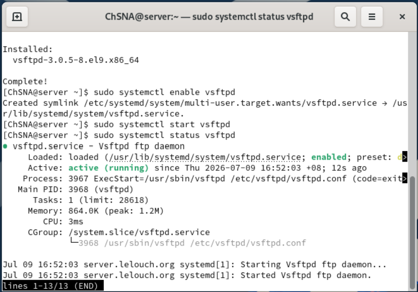

## Basic FTP Configuration

Anonymous FTP access was disabled, while local user login and write access were enabled.

```conf
anonymous_enable=NO
local_enable=YES
write_enable=YES
```

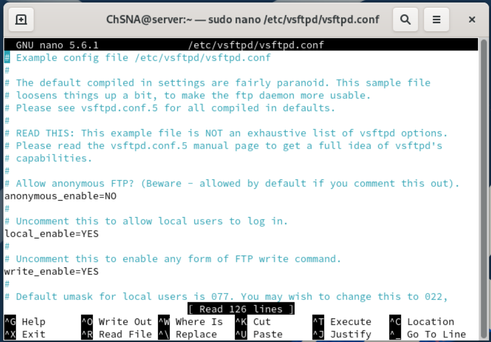

## Chroot Configuration

Local users were restricted to their FTP environment using chroot settings.

```conf
chroot_local_user=YES
chroot_list_enable=YES
allow_writeable_chroot=YES
chroot_list_file=/etc/vsftpd/chroot_list
ls_recurse_enable=YES
```

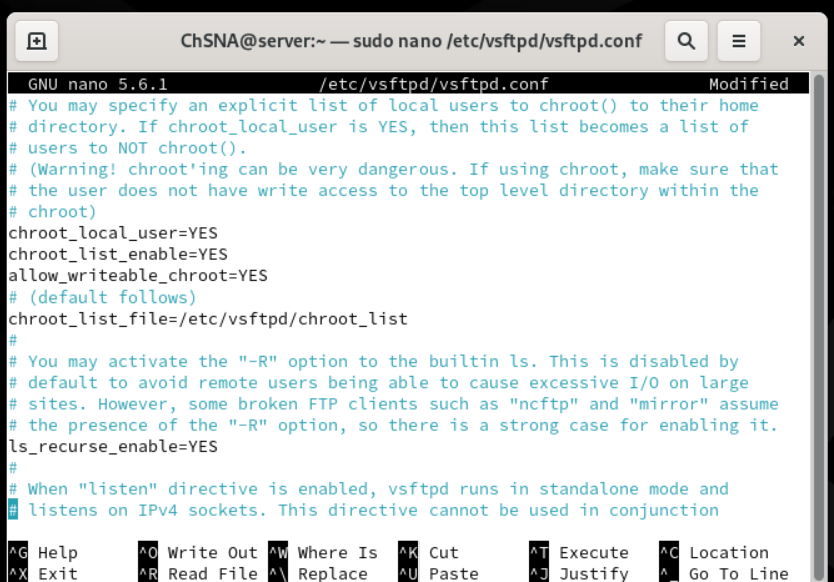

## Additional FTP Settings

The FTP server was configured with a local root directory and other service settings.

```conf
local_root=public_html
use_localtime=YES
seccomp_sandbox=NO
```

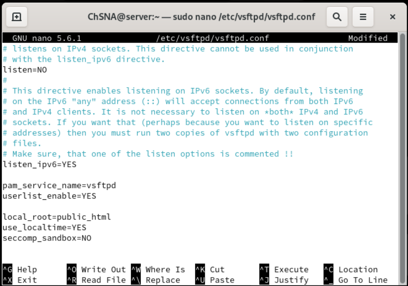

## FTP Firewall Rules

The FTP service was allowed through the firewall.

```bash
sudo firewall-cmd --add-service=ftp
sudo firewall-cmd --runtime-to-permanent
sudo firewall-cmd --reload
sudo firewall-cmd --list-all
```

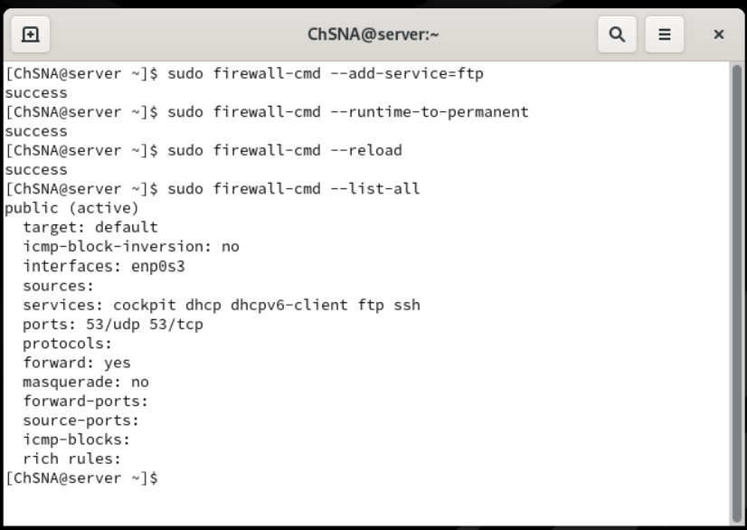

## FTPS Certificate Generation

OpenSSL was used to generate a self-signed certificate for `vsftpd`.

```bash
sudo dnf install openssl
sudo mkdir /etc/ssl/vsftpd
sudo openssl req -x509 -nodes -keyout /etc/ssl/vsftpd/vsftpd-selfsigned.pem -out /etc/ssl/vsftpd/vsftpd-selfsigned.pem -days 365 -newkey rsa:2048
```

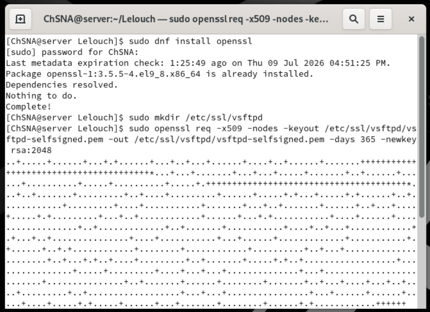

## Certificate File Verification

The certificate file was created inside `/etc/ssl/vsftpd/`.

```bash
sudo ls -l /etc/ssl/vsftpd/
```

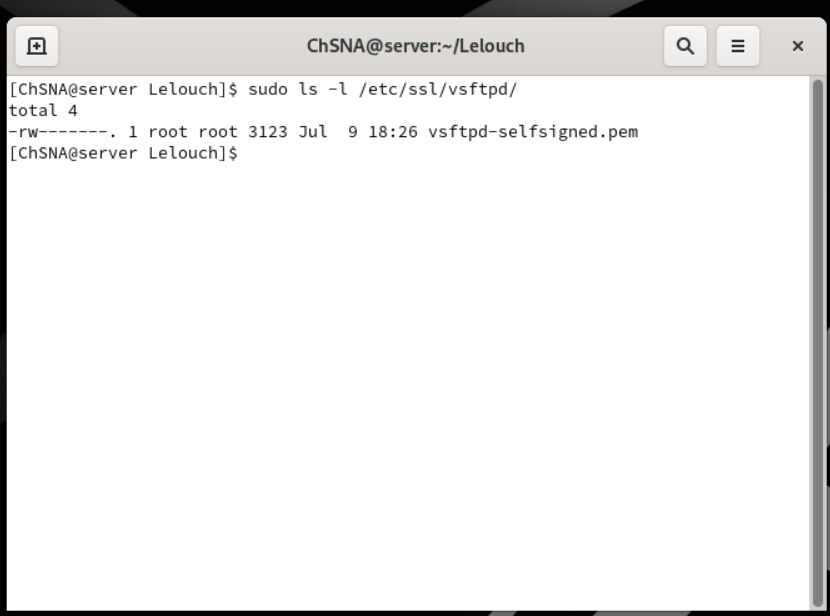

> The certificate/private key file was not uploaded to GitHub for security reasons.

## SSL/TLS Configuration

SSL/TLS was enabled in the `vsftpd` configuration file.

```conf
ssl_enable=YES
ssl_tlsv1_2=YES
ssl_sslv2=NO
ssl_sslv3=NO

rsa_cert_file=/etc/ssl/vsftpd/vsftpd-selfsigned.pem
rsa_private_key_file=/etc/ssl/vsftpd/vsftpd-selfsigned.pem
```

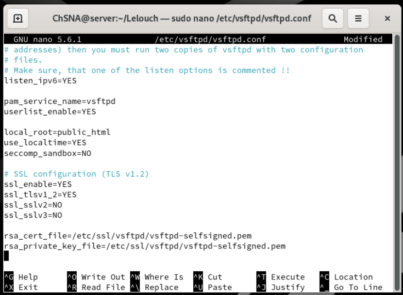

## FTPS Security and Passive Mode Configuration

The server was configured to force SSL/TLS for local user logins and data transfers.

Passive mode ports were also configured for FTPS file transfers.

```conf
allow_anon_ssl=NO
force_local_data_ssl=YES
force_local_logins_ssl=YES
ssl_ciphers=HIGH
require_ssl_reuse=NO

pasv_min_port=40000
pasv_max_port=40001
debug_ssl=YES
```

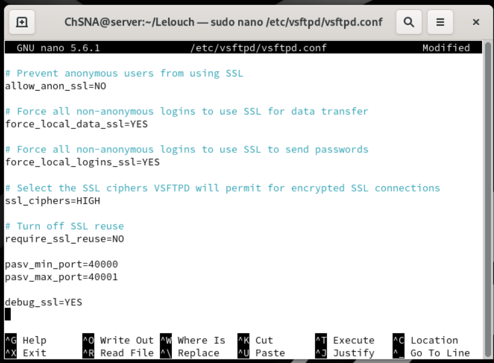

## FTPS Service Status

After updating the configuration, the `vsftpd` service was restarted successfully.

```bash
sudo systemctl restart vsftpd
sudo systemctl status vsftpd
```

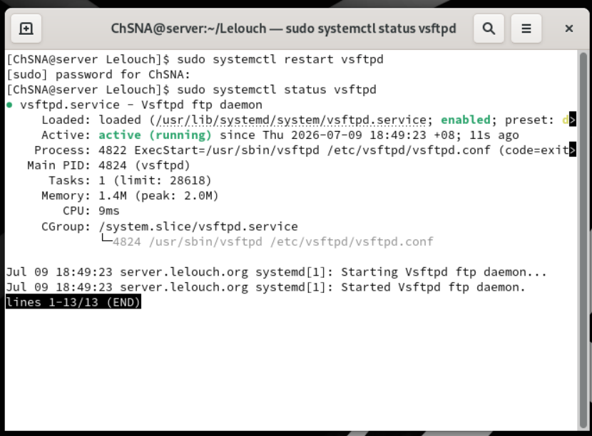

## FTPS Firewall Rules

The firewall was updated to allow FTPS and passive mode ports.

```bash
sudo firewall-cmd --permanent --add-port=990/tcp
sudo firewall-cmd --permanent --add-port=40000-40001/tcp
sudo firewall-cmd --reload
sudo firewall-cmd --list-all
```

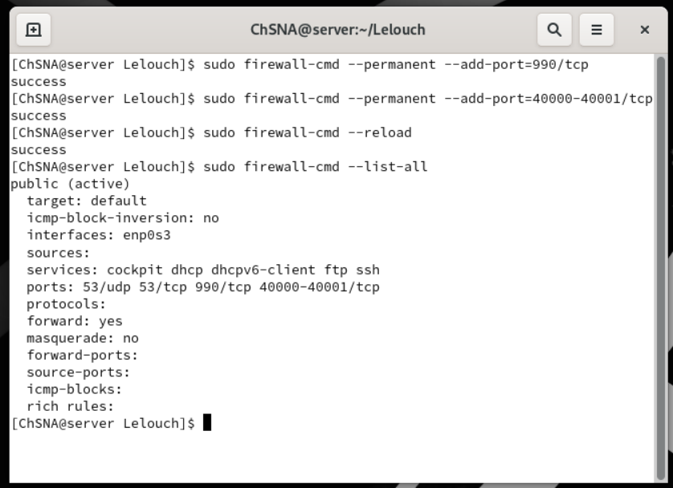

## FileZilla FTPS Client Configuration

FileZilla was configured on the Ubuntu client to connect to the Rocky Linux server using explicit FTP over TLS.

| Setting | Value |
|---|---|
| Protocol | FTP - File Transfer Protocol |
| Host | 192.168.200.3 |
| Encryption | Require explicit FTP over TLS |
| User | ChSNA |

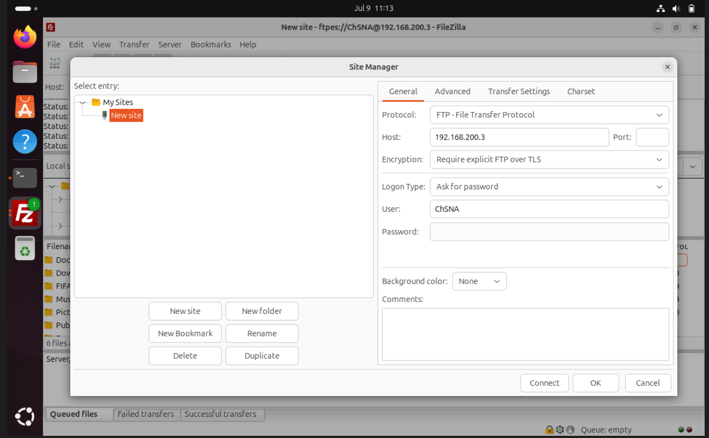

## FTPS Connection Test

FileZilla successfully established a TLS connection to the Rocky Linux server.

The connection log shows:

```text
Initializing TLS...
TLS connection established.
Logged in
Directory listing successful
```

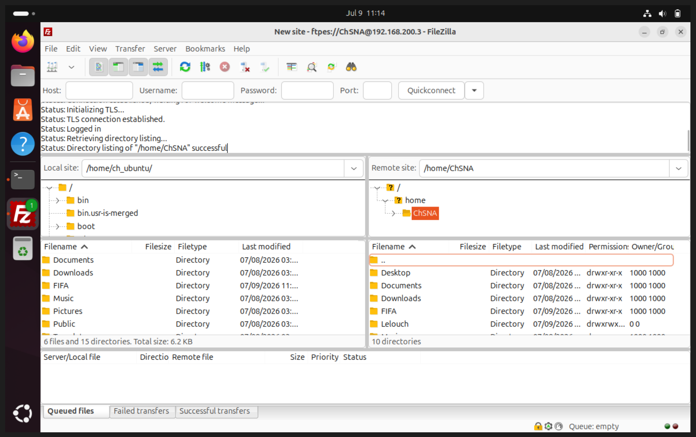

## FTPS File Transfer Test

A file transfer was tested successfully using FileZilla over FTPS.

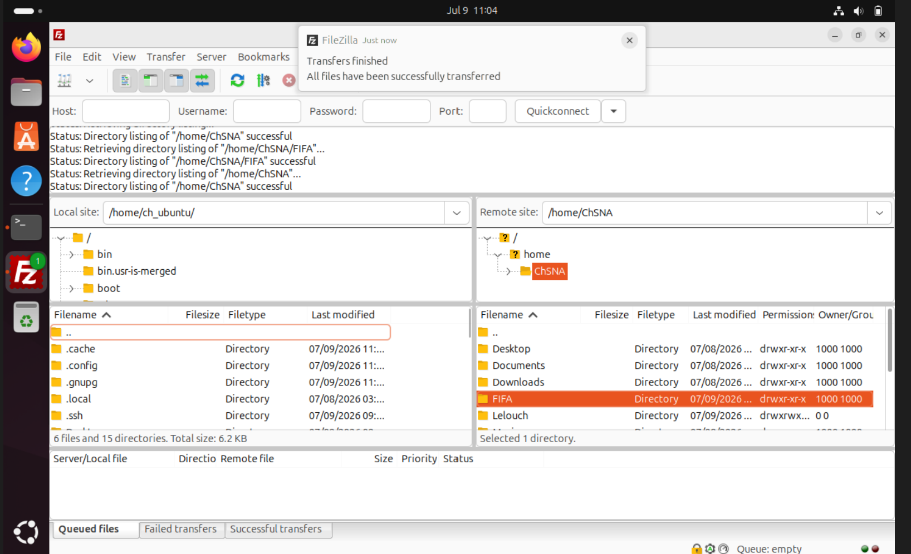

## Result

The FTP server was configured successfully using `vsftpd`.

The service was then secured using SSL/TLS, and FileZilla confirmed that a TLS connection could be established from the Ubuntu client.

The final file transfer test was successful, confirming that FTPS was working correctly.
