# Mail Server Configuration

## Objective

The objective of this section is to configure a local mail server on Rocky Linux using Postfix and Dovecot.

Postfix is used for sending and delivering mail, while Dovecot is used to access user mailboxes using IMAP/IMAPS.

The final setup was tested from an Ubuntu client using Thunderbird.

## Lab Information

| Machine | Role | Hostname | IP Address |
|---|---|---|---|
| Rocky Server | Mail Server | server.lelouch.org | 192.168.200.3 |
| Ubuntu Client | Mail Client | client.lelouch.org | 192.168.200.80 |

## Mail Services Used

| Service | Purpose |
|---|---|
| Postfix | SMTP server for sending and delivering mail |
| Dovecot | IMAP/IMAPS server for reading mail |
| BIND DNS | Mail DNS records using A and MX records |
| OpenSSL | Self-signed TLS certificate generation |
| Thunderbird | Mail client used for testing |

## Configuration Files

The important configuration files are stored in the `config/mail/` folder.

| File | Purpose |
|---|---|
| [postfix-main.cf](../config/mail/postfix-main.cf) | Main Postfix mail server configuration |
| [postfix-master.cf](../config/mail/postfix-master.cf) | Postfix service configuration for SMTP and submission port |
| [dovecot-10-mail.conf](../config/mail/dovecot-10-mail.conf) | Dovecot Maildir location configuration |
| [dovecot-10-auth.conf](../config/mail/dovecot-10-auth.conf) | Dovecot authentication configuration |
| [dovecot-10-ssl.conf](../config/mail/dovecot-10-ssl.conf) | Dovecot SSL/TLS configuration |
| [dovecot-10-master.conf](../config/mail/dovecot-10-master.conf) | Dovecot authentication socket for Postfix |

## DNS Mail Records

The DNS forward zone was updated to include an MX record for the domain and an A record for the mail server.

```dns
@       IN      MX      10 mail.lelouch.org.
mail    IN      A       192.168.200.3
```

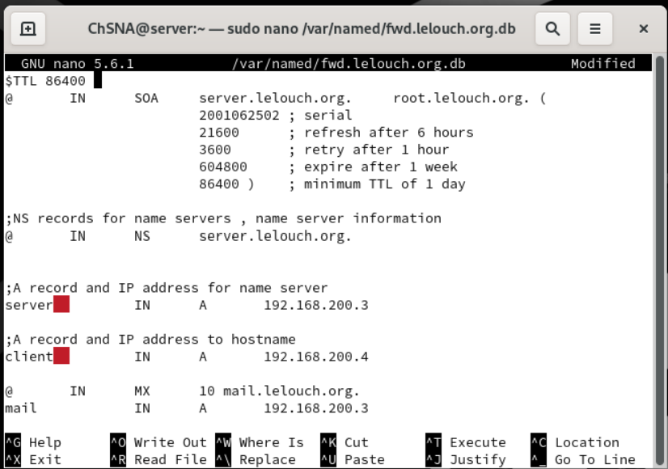

The DNS zone was validated using `named-checkzone`, and the MX/A records were tested using `nslookup`.

```bash
sudo named-checkzone lelouch.org /var/named/fwd.lelouch.org.db
sudo systemctl restart named
nslookup -type=mx lelouch.org 192.168.200.3
nslookup mail.lelouch.org 192.168.200.3
```

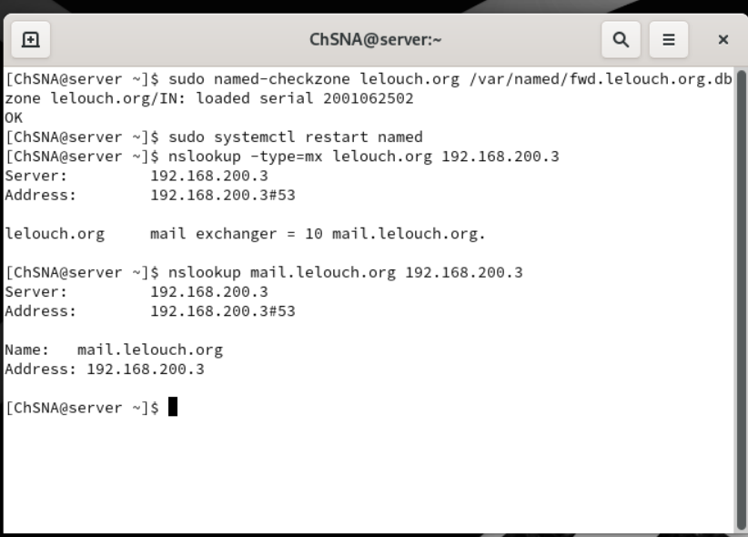

## Package Installation

Postfix, Dovecot, and OpenSSL were installed on the Rocky Linux server.

```bash
sudo dnf install -y postfix dovecot openssl
rpm -q postfix dovecot openssl
```

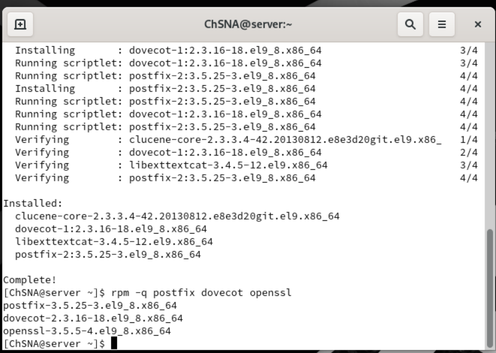

## TLS Certificate Generation

A self-signed TLS certificate was generated for the mail server.

```bash
sudo mkdir -p /etc/ssl/mail

sudo openssl req -x509 -nodes -newkey rsa:2048 -days 365 \
-keyout /etc/ssl/mail/mailserver.key \
-out /etc/ssl/mail/mailserver.crt \
-subj "/C=MY/ST=KualaLumpur/L=KualaLumpur/O=LinuxLab/OU=Mail/CN=mail.lelouch.org"

sudo chmod 600 /etc/ssl/mail/mailserver.key
sudo ls -l /etc/ssl/mail/
```

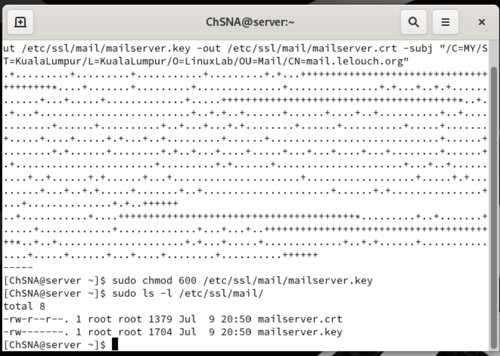

> The private key file was not uploaded to GitHub for security reasons.

## Postfix Main Configuration

Postfix was configured with the domain `lelouch.org` and hostname `mail.lelouch.org`.

The mail storage format was set to `Maildir/`.

```conf
myhostname = mail.lelouch.org
mydomain = lelouch.org
myorigin = $mydomain

inet_interfaces = all
inet_protocols = ipv4

mydestination = $myhostname, localhost.$mydomain, localhost, $mydomain
mynetworks = 127.0.0.0/8, 192.168.200.0/24

home_mailbox = Maildir/
```

TLS was also enabled using the generated certificate.

```conf
smtpd_tls_cert_file = /etc/ssl/mail/mailserver.crt
smtpd_tls_key_file = /etc/ssl/mail/mailserver.key
smtpd_tls_security_level = may
```

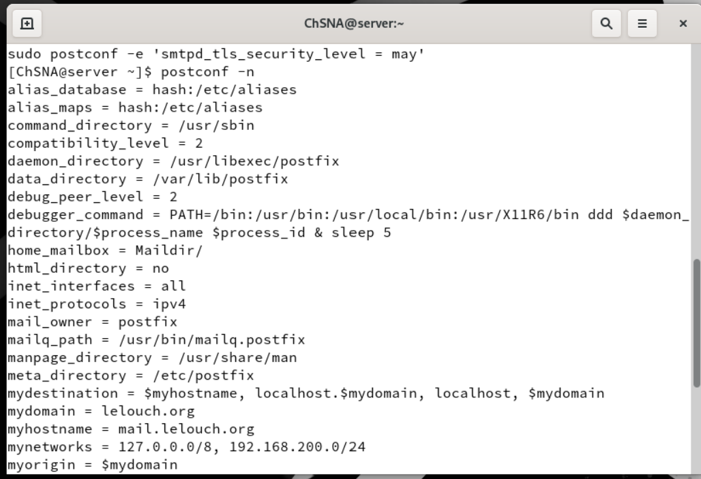

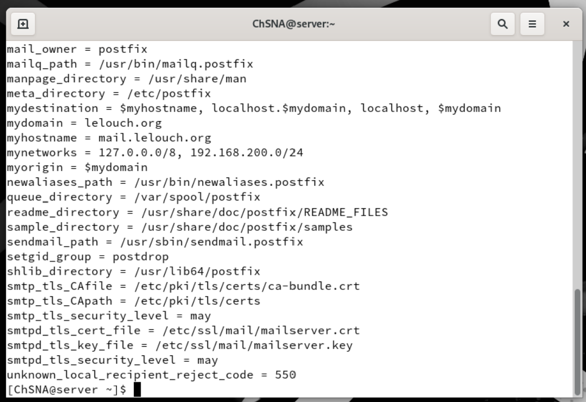

## Dovecot Mail Location

Dovecot was configured to use the Maildir format.

```conf
mail_location = maildir:~/Maildir
```

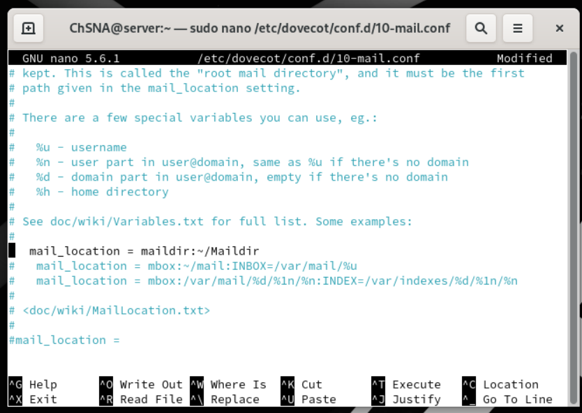

## Dovecot Authentication

Plaintext authentication was disabled unless SSL/TLS is used.

The `plain` and `login` authentication mechanisms were enabled for mail client login.

```conf
disable_plaintext_auth = yes
auth_mechanisms = plain login
```

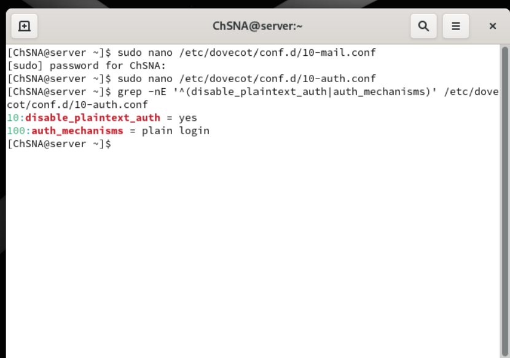

## Dovecot SSL/TLS Configuration

Dovecot was configured to require SSL/TLS and use the generated mail certificate.

```conf
ssl = required
ssl_cert = </etc/ssl/mail/mailserver.crt
ssl_key = </etc/ssl/mail/mailserver.key
```

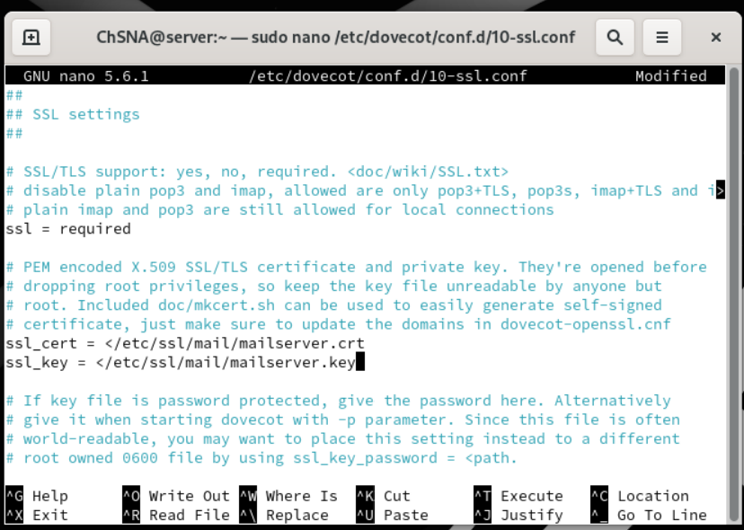

## Postfix and Dovecot Authentication Socket

A Dovecot authentication socket was configured so that Postfix can authenticate users through Dovecot.

```conf
service auth {
  unix_listener /var/spool/postfix/private/auth {
    mode = 0660
    user = postfix
    group = postfix
  }
}
```

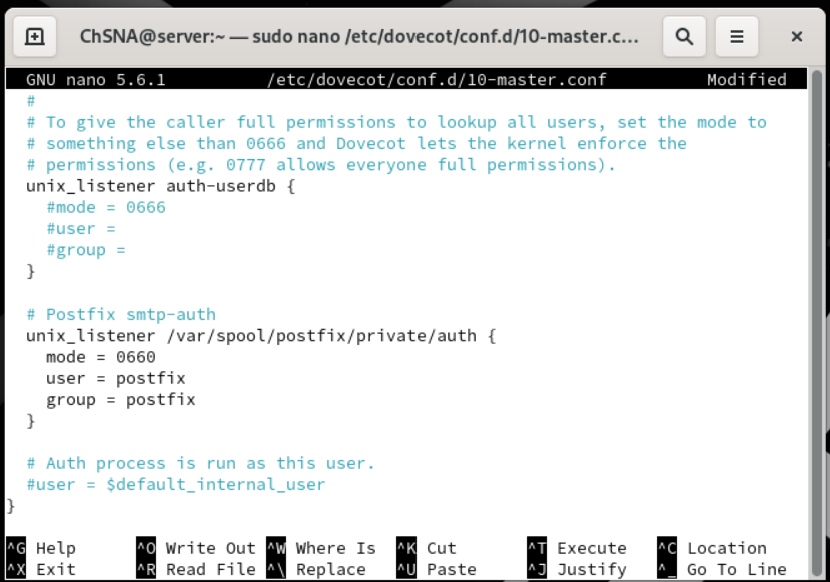

## Postfix SASL Configuration

Postfix was configured to use Dovecot for SMTP authentication.

```conf
smtpd_sasl_type = dovecot
smtpd_sasl_path = private/auth
smtpd_sasl_auth_enable = yes
smtpd_tls_auth_only = yes
smtpd_recipient_restrictions = permit_mynetworks, permit_sasl_authenticated, reject_unauth_destination
```

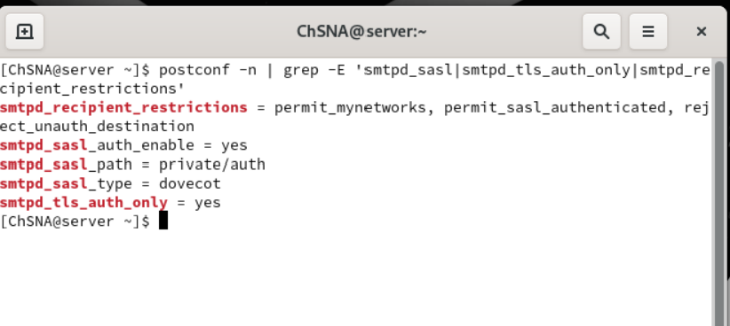

## Service Status

Postfix and Dovecot were enabled, restarted, and verified.

```bash
sudo systemctl enable --now postfix dovecot
sudo systemctl restart postfix dovecot
sudo systemctl status postfix
sudo systemctl status dovecot
```

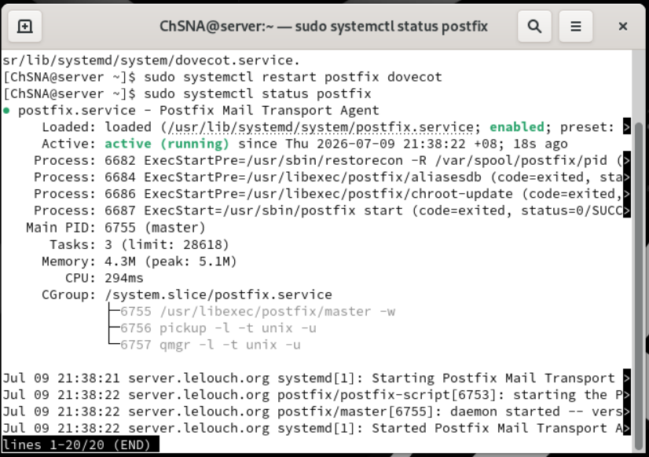

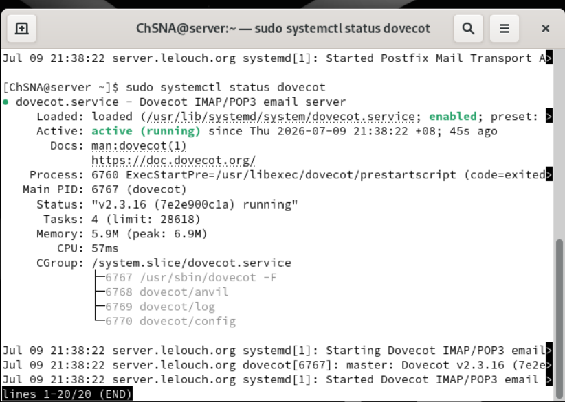

## SMTP Submission Port

The Postfix submission service was enabled on port `587`.

```conf
submission inet n       -       n       -       -       smtpd
```

The listening ports were verified using `ss`.

```bash
sudo ss -tulpn | grep master
```

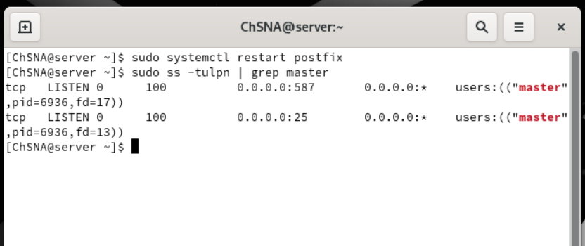

## Firewall Configuration

The required mail ports were allowed through the firewall.

```bash
sudo firewall-cmd --permanent --add-port=25/tcp
sudo firewall-cmd --permanent --add-port=587/tcp
sudo firewall-cmd --permanent --add-port=993/tcp
sudo firewall-cmd --reload
sudo firewall-cmd --list-all
```

| Port | Purpose |
|---|---|
| 25/tcp | SMTP |
| 587/tcp | SMTP Submission |
| 993/tcp | IMAPS |

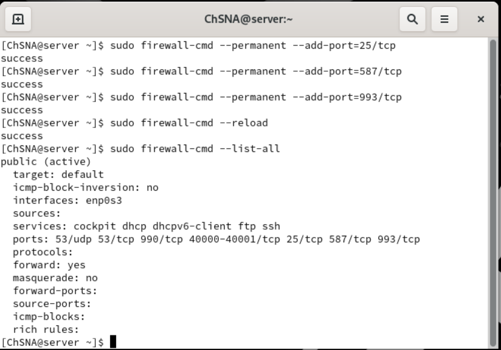

## Dovecot Listening Ports

Dovecot was verified using `ss`.

```bash
sudo ss -tulpn | grep dovecot
```

The important secure port for this project is `993/tcp`, which is used for IMAPS.

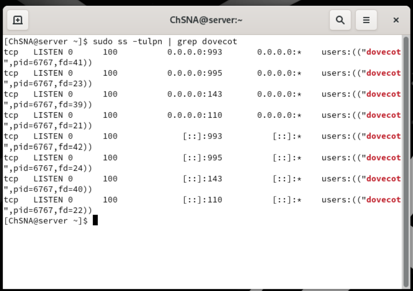

## Local Mail Delivery Test

A local mail delivery test was performed from the Rocky Linux server.

The test confirmed that mail sent to `robin@lelouch.org` was delivered to the `Maildir` mailbox.

```bash
sudo ls -R /home/robin/Maildir | head -30
sudo ls -l /home/robin/Maildir/new
```

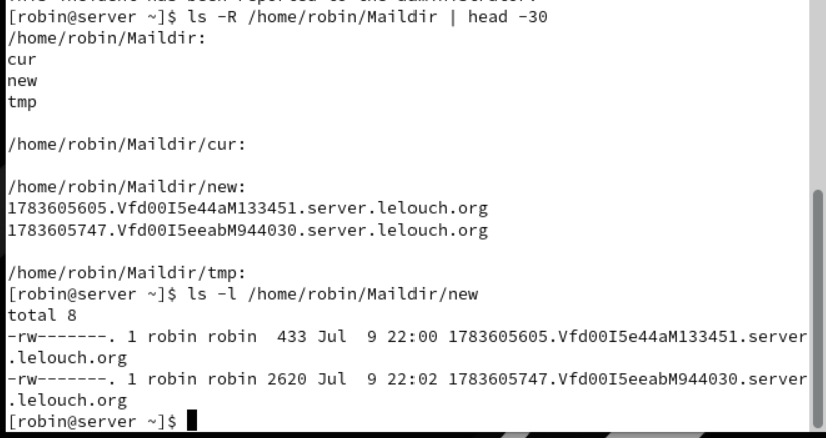

## Ubuntu DNS Mail Test

The Ubuntu client was able to resolve the mail server and MX record using the Rocky DNS server.

```bash
nslookup mail.lelouch.org 192.168.200.3
nslookup -type=mx lelouch.org 192.168.200.3
```

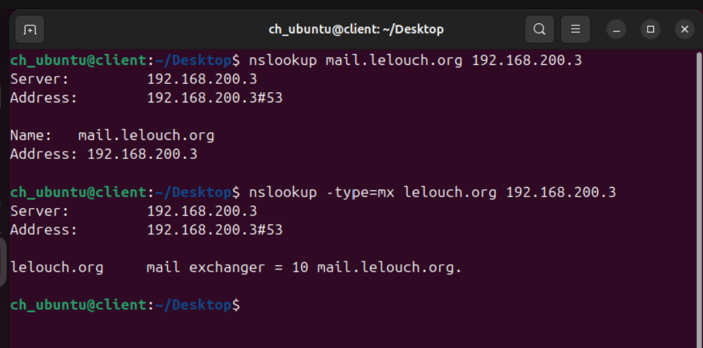

## Thunderbird Client Configuration

Thunderbird was configured on the Ubuntu client using the Rocky mail server IP address.

The DNS records were verified separately using `nslookup`.

| Setting | Value |
|---|---|
| Incoming protocol | IMAP |
| Incoming server | 192.168.200.3 |
| Incoming port | 993 |
| Incoming security | SSL/TLS |
| Outgoing server | 192.168.200.3 |
| Outgoing port | 587 |
| Outgoing security | STARTTLS |
| Authentication | Normal password |
| Username | robin |

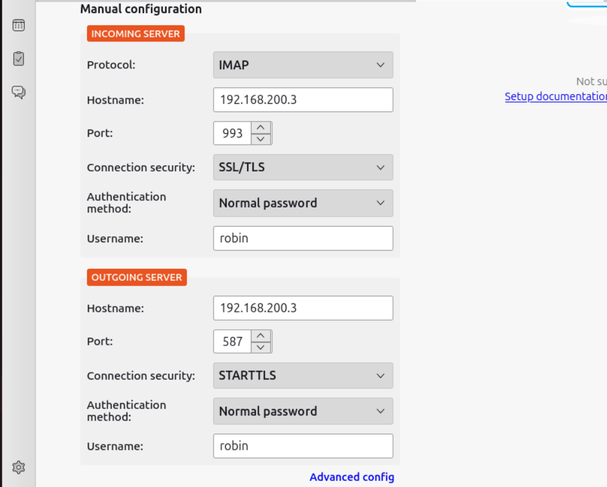

The account was created successfully, and Thunderbird received the existing local test emails.

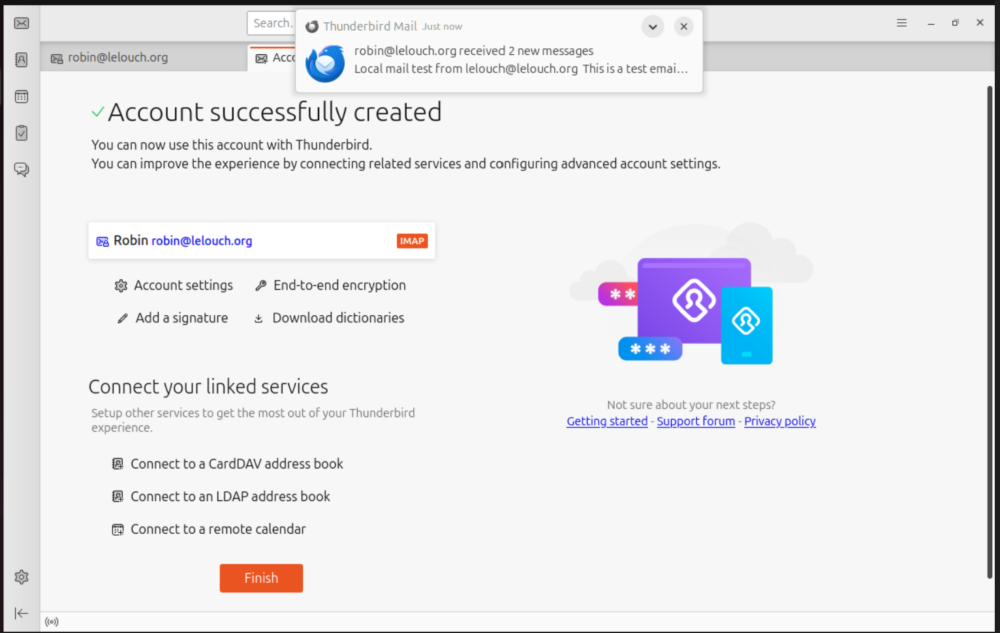

## Final Send and Receive Test

A final test was performed using Thunderbird.

The test confirmed that:

- `lelouch@lelouch.org` can send mail to `robin@lelouch.org`
- `robin@lelouch.org` can reply to `lelouch@lelouch.org`
- Thunderbird can send mail through Postfix
- Thunderbird can read mail through Dovecot

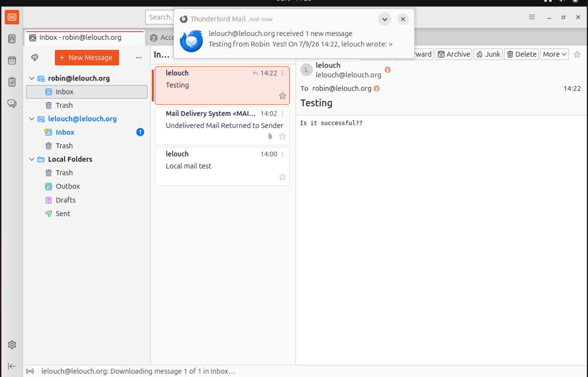

## Troubleshooting

During testing, Thunderbird initially failed to send mail because the outgoing SMTP server hostname was incorrect.

The outgoing server was corrected to use the Rocky mail server IP address:

```text
192.168.200.3
```

After updating the SMTP server settings, Thunderbird successfully sent and received mail.

## Result

The mail server was successfully configured using Postfix and Dovecot.

Postfix handled SMTP mail delivery, Dovecot provided IMAPS mailbox access, and Thunderbird was able to send and receive emails between local users.

The final result confirms that the Rocky Linux mail server is working correctly in the local lab environment.
