# NFS Server Configuration

## Objective

The objective of this section is to configure an NFS server on Rocky Linux and mount the shared directory from an Ubuntu client.

NFS, or Network File System, allows a client machine to access files stored on a remote server as if they were local files. In this lab, Rocky Linux acts as the NFS server, and Ubuntu acts as the NFS client.

The goal is to verify that files created on the server are visible from the client, and files created from the client are also visible on the server.

## Lab Information

| Machine | Role | Hostname | IP Address |
|---|---|---|---|
| Rocky Server | NFS Server | server.lelouch.org | 192.168.200.3 |
| Ubuntu Client | NFS Client | client.lelouch.org | 192.168.200.80 |

## NFS Share Information

| Item | Value |
|---|---|
| Shared directory on Rocky | `/var/nfs/general` |
| Mount point on Ubuntu | `/nfs/Shared_From_server` |
| Allowed client | `192.168.200.80` |
| NFS server IP | `192.168.200.3` |

## Configuration Files

The important NFS configuration files are stored in the `config/nfs/` folder.

| File | Purpose |
|---|---|
| [exports](../config/nfs/exports) | Defines the NFS shared directory and client access |
| [fstab-nfs-entry](../config/nfs/fstab-nfs-entry) | Shows the permanent NFS mount entry used on Ubuntu |

## NFS Server Installation and Status

The NFS server package was installed on Rocky Linux using `nfs-utils`.

The `nfs-server` service was then enabled and verified.

```bash
sudo dnf install -y nfs-utils
sudo systemctl enable --now nfs-server
sudo systemctl status nfs-server
sudo cat /proc/fs/nfsd/versions
```

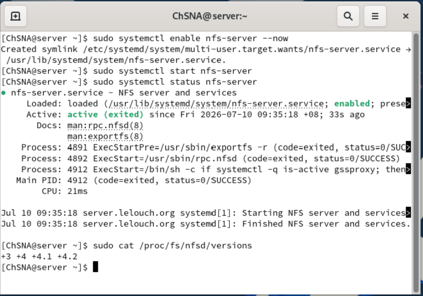

## Shared Directory Creation

A shared directory was created on the Rocky server:

```bash
sudo mkdir -p /var/nfs/general
```

The ownership was changed to `nobody:nobody`. This is commonly used with NFS because root operations from the client can be mapped to the `nobody` user for security.

```bash
sudo chown nobody:nobody /var/nfs/general
sudo ls -ld /var/nfs/general
```

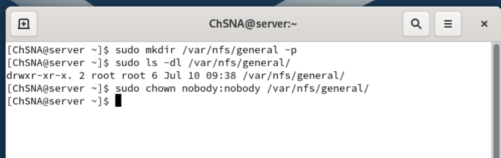

## NFS Export Configuration

The shared directory was added to `/etc/exports`.

```conf
/var/nfs/general 192.168.200.80(rw,sync,no_subtree_check)
```

This configuration means:

| Option | Meaning |
|---|---|
| `/var/nfs/general` | Directory shared from Rocky |
| `192.168.200.80` | Ubuntu client allowed to access the share |
| `rw` | Client has read and write access |
| `sync` | Writes are committed safely to disk |
| `no_subtree_check` | Disables subtree checking to improve reliability |

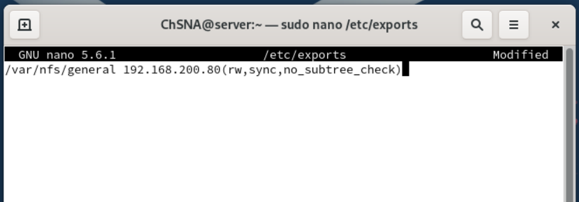

## Export Verification

After editing `/etc/exports`, the NFS exports were reloaded and verified.

```bash
sudo exportfs -arv
sudo exportfs -s
```

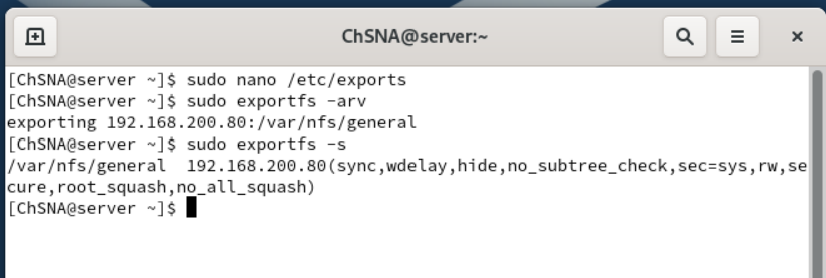

## Firewall Configuration

The required NFS services were allowed through the Rocky firewall.

```bash
sudo firewall-cmd --permanent --add-service={nfs,nfs3,rpc-bind,mountd}
sudo firewall-cmd --reload
sudo firewall-cmd --zone=public --list-all
```

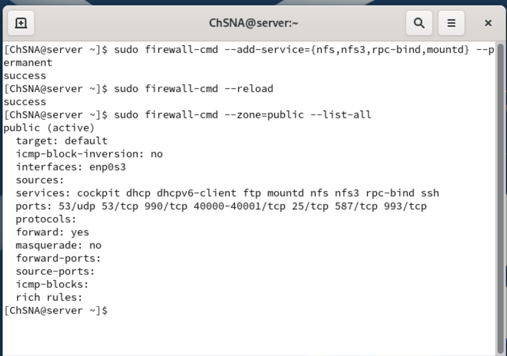

## Server Test Files

Test files were created inside the shared directory on the Rocky server.

```bash
cd /var/nfs/general
sudo touch ProjectDoc{1..4}.txt
ls -l
```

These files were used to verify that Ubuntu could see the shared directory content after mounting the NFS share.

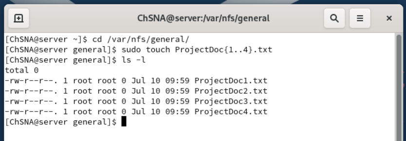

## Ubuntu NFS Client Installation

On Ubuntu, the NFS client package was installed using `nfs-common`.

```bash
sudo apt install nfs-common
```

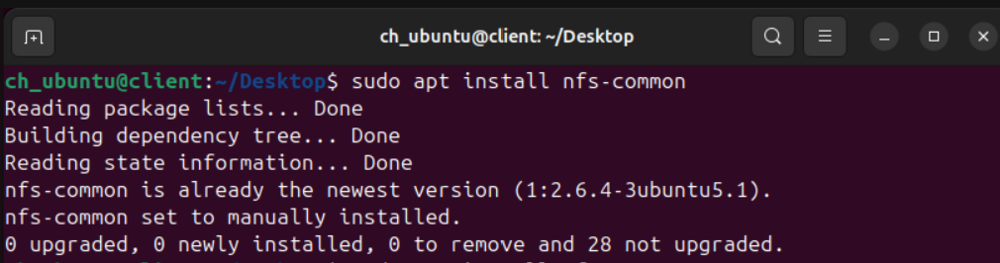

## Mounting the NFS Share on Ubuntu

A local mount point was created on Ubuntu.

```bash
sudo mkdir -p /nfs/Shared_From_server
```

The NFS share from Rocky was then mounted to the Ubuntu mount point.

```bash
sudo mount 192.168.200.3:/var/nfs/general /nfs/Shared_From_server
df -h
```

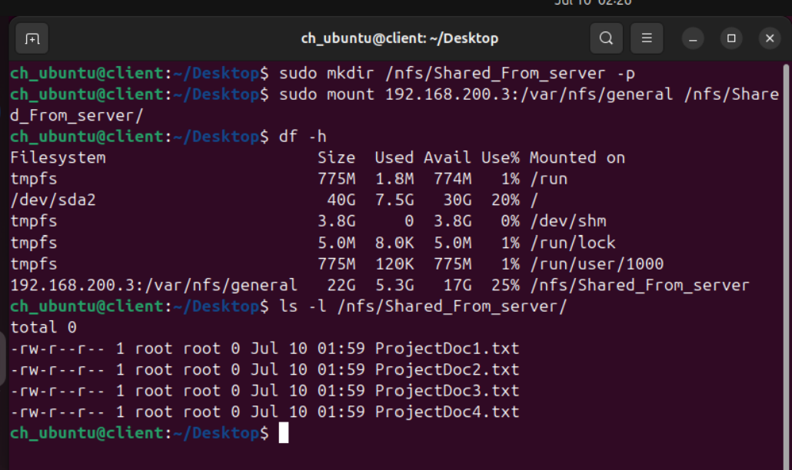

## Client Access Test

After mounting the NFS share, Ubuntu was able to view the files created on Rocky.

```bash
ls -l /nfs/Shared_From_server
```

A test file was then created from Ubuntu inside the mounted NFS directory.

```bash
sudo touch /nfs/Shared_From_server/Test_From_Client.txt
ls -l /nfs/Shared_From_server
```

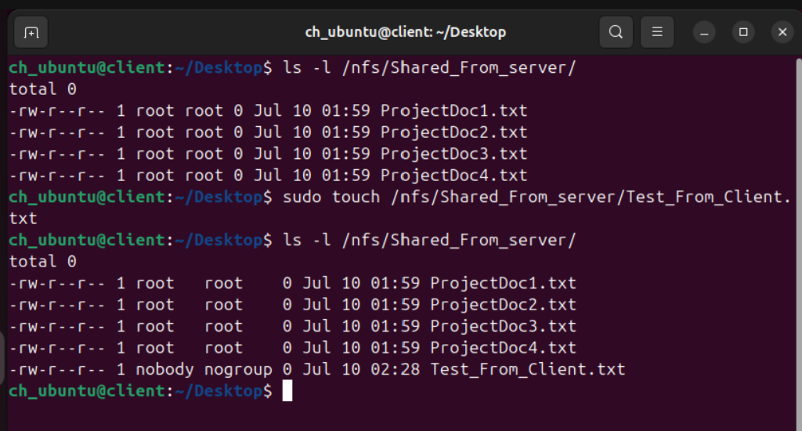

## Server-Side Verification

Back on Rocky, the file created from Ubuntu was visible inside `/var/nfs/general`.

```bash
ls -l /var/nfs/general
```

This confirms that both machines were accessing the same shared directory.

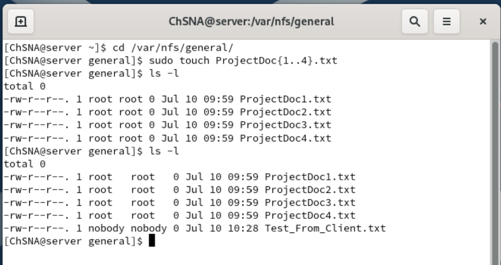

## Permanent NFS Mount

The NFS mount was also added to `/etc/fstab` on Ubuntu to make the mount persistent.

```conf
192.168.200.3:/var/nfs/general /nfs/Shared_From_server nfs auto,nofail,noatime,nolock,intr,tcp,actimeo=1800 0 0
```

This allows Ubuntu to mount the NFS share automatically after reboot or when running `mount -a`.

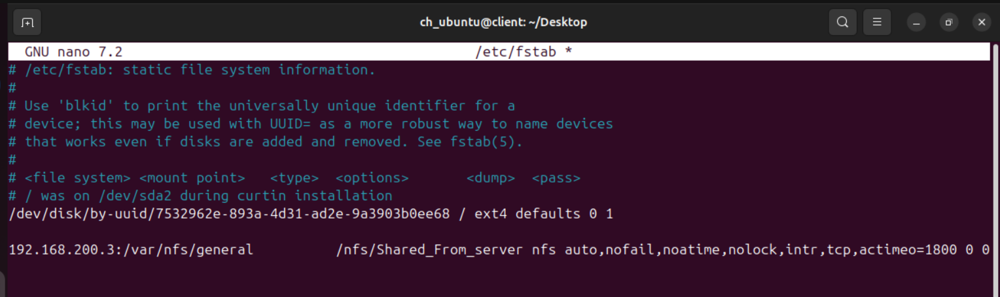

The permanent mount was tested using:

```bash
sudo mount -a
df -h | grep nfs
ls -l /nfs/Shared_From_server
```

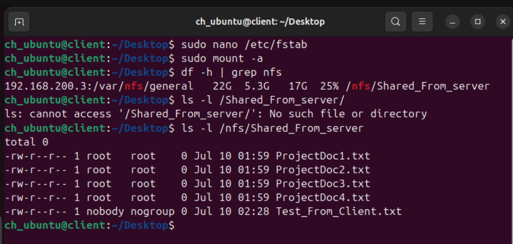

## Result

The NFS server was successfully configured on Rocky Linux.

The Ubuntu client was able to mount the shared directory, view files created on the server, and create files that were visible from the server side.

The permanent mount configuration was also added to `/etc/fstab`, making the NFS share more practical for long-term use in the lab environment.
