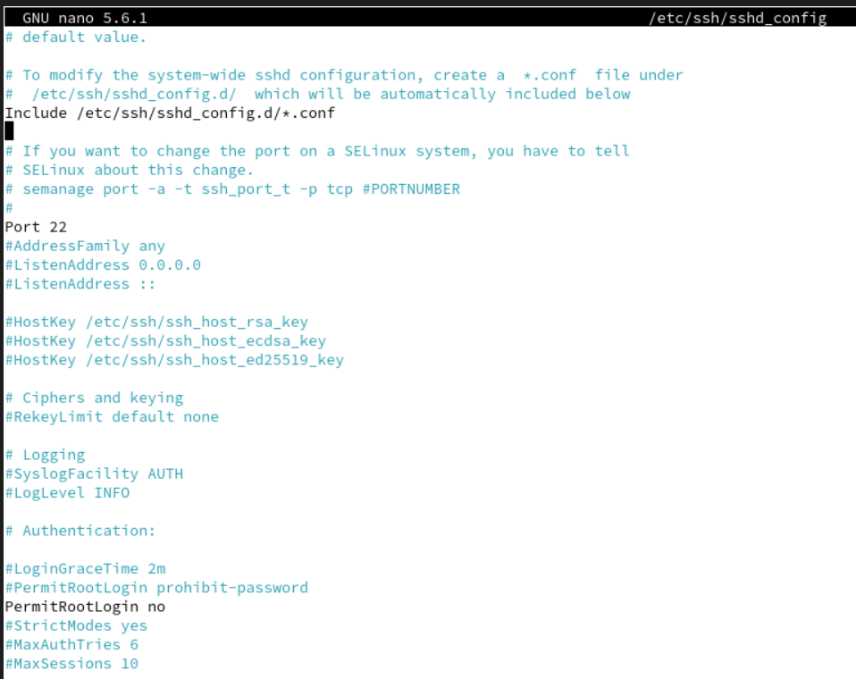
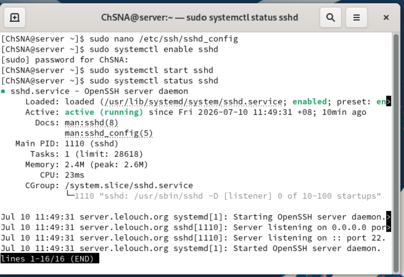
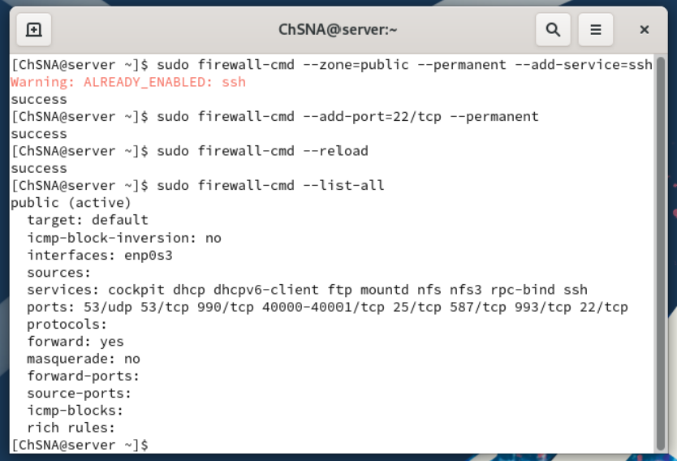
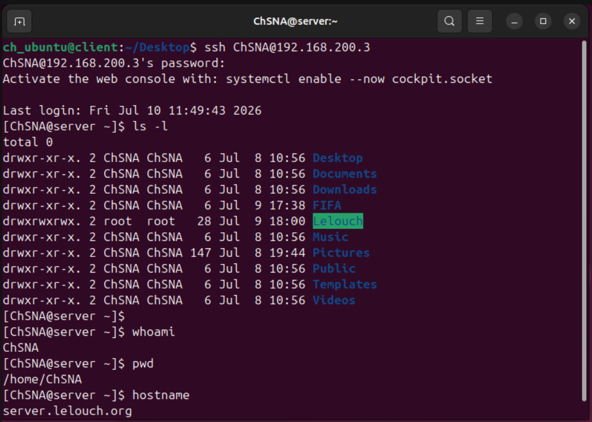

# SSH Server Configuration

## Objective

The objective of this section is to configure SSH on the Rocky Linux server and verify secure remote access from the Ubuntu client.

SSH, or Secure Shell, is used to remotely access and manage Linux systems through an encrypted connection. It is one of the most important services for Linux server administration because it allows an administrator to manage a server without physically using the server machine.

In this lab:

- Rocky Linux acts as the SSH server
- Ubuntu acts as the SSH client
- The Ubuntu client connects remotely to the Rocky server using SSH

## Lab Information

| Machine | Role | Hostname | IP Address |
|---|---|---|---|
| Rocky Server | SSH Server | server.lelouch.org | 192.168.200.3 |
| Ubuntu Client | SSH Client | client.lelouch.org | 192.168.200.80 |

## SSH Configuration Overview

This section includes:

- Verifying the SSH server configuration file
- Keeping SSH on the default port `22`
- Disabling direct root login
- Enabling and starting the SSH service
- Allowing SSH through the firewall
- Testing SSH remote access from Ubuntu to Rocky

## Configuration File

The important SSH configuration is stored in the `config/ssh/` folder.

| File | Purpose |
|---|---|
| [sshd_config](../config/ssh/sshd_config) | Important SSH server configuration settings |

Only the important active configuration lines were added to GitHub. The original `/etc/ssh/sshd_config` file contains many comments and default settings, so the GitHub version is a cleaned configuration excerpt.

## SSH Server Configuration

The SSH server configuration file is located at:

```text
/etc/ssh/sshd_config
```

The following important settings were configured or verified:

```conf
Port 22
PermitRootLogin no
```

Explanation:

| Setting | Purpose |
|---|---|
| `Port 22` | Uses the default SSH port |
| `PermitRootLogin no` | Disables direct SSH login as the root user |

Disabling direct root login is a security improvement. Instead of logging in directly as `root`, users should connect with a normal user account and use `sudo` when administrative privileges are required.



## SSH Service Status

The SSH service was enabled and started on the Rocky Linux server.

```bash
sudo systemctl enable sshd
sudo systemctl start sshd
sudo systemctl status sshd
```

The service status confirmed that `sshd` was enabled and active.



## Firewall Configuration

SSH was allowed through the Rocky Linux firewall.

```bash
sudo firewall-cmd --zone=public --permanent --add-service=ssh
sudo firewall-cmd --permanent --add-port=22/tcp
sudo firewall-cmd --reload
sudo firewall-cmd --list-all
```

SSH uses TCP port `22`.

| Port | Service | Purpose |
|---|---|---|
| 22/tcp | SSH | Secure remote login and administration |

The firewall output confirmed that SSH access was allowed.



## SSH Remote Access Test

From the Ubuntu client, an SSH connection was made to the Rocky Linux server.

```bash
ssh ChSNA@192.168.200.3
```

After entering the password, the Ubuntu client successfully connected to the Rocky server.

The terminal prompt changed to the Rocky server user session:

```text
[ChSNA@server ~]$
```

This confirms that the Ubuntu client was connected remotely to the Rocky server.

## Remote Command Test

After connecting through SSH, several commands were executed remotely on the Rocky server:

```bash
ls -l
whoami
pwd
hostname
```

The output confirmed that:

- The connected user was `ChSNA`
- The current directory was `/home/ChSNA`
- The remote hostname was `server.lelouch.org`
- Commands could be executed on Rocky from the Ubuntu client



## Troubleshooting Checks

Useful SSH troubleshooting commands include:

```bash
sudo systemctl status sshd
sudo journalctl -u sshd
sudo sshd -t
sudo firewall-cmd --list-all
sudo ss -tulpn | grep sshd
```

These commands help verify:

- SSH service status
- SSH logs
- SSH configuration syntax
- Firewall rules
- Listening SSH port

Common issues to check:

| Issue | Possible Cause |
|---|---|
| SSH connection refused | `sshd` service not running |
| SSH timeout | Firewall blocking port 22 |
| Login denied | Wrong username or password |
| Root login blocked | `PermitRootLogin no` is enabled |
| Configuration error | Syntax error inside `sshd_config` |

## Result

SSH was successfully configured on the Rocky Linux server.

The Ubuntu client was able to connect remotely to the Rocky server using SSH, and commands were executed successfully from the remote session.

This confirms that secure remote administration is working in the local lab environment.
