# Apache Web Server Configuration

## Objective

The objective of this section is to configure Apache Web Server on Rocky Linux, test basic HTTP access from the Ubuntu client, then secure the website using HTTPS with a self-signed SSL/TLS certificate.

Apache is used to host a web page from the Rocky Linux server. The Ubuntu client is used to verify that the website is accessible from another machine in the lab network.

This section shows the full configuration process:

- Installing and enabling Apache
- Opening HTTP access in the firewall
- Testing the default Apache page from Ubuntu
- Creating a custom web directory and HTML page
- Configuring an HTTP VirtualHost
- Generating a self-signed SSL/TLS certificate
- Configuring HTTPS
- Fixing the default SSL certificate path issue
- Opening HTTPS access in the firewall
- Testing the final professional website from Ubuntu using the local DNS hostname

## Lab Information

| Machine | Role | Hostname | IP Address |
|---|---|---|---|
| Rocky Server | Apache Web Server | server.lelouch.org | 192.168.200.3 |
| Ubuntu Client | Web Client | client.lelouch.org | 192.168.200.80 |

## Apache Web Server Overview

In this lab, Rocky Linux hosts a website using Apache HTTP Server.

The web flow is:

```text
Ubuntu Browser → HTTP/HTTPS Request → Apache on Rocky → Website Content
```

In simple terms:

1. Apache runs on the Rocky Linux server.
2. The website files are stored in `/var/www/lelouch.org`.
3. Ubuntu accesses the website from the lab network.
4. HTTP is tested first on port `80`.
5. HTTPS is then configured on port `443` using a self-signed certificate.
6. The final test is performed using the DNS hostname `server.lelouch.org`.

The IP address was used during the first tests to confirm basic Apache connectivity. The final HTTPS test used the DNS hostname because it is more realistic and matches the Apache VirtualHost configuration.

## Configuration Files

The important Apache configuration files are stored in the `config/apache/` folder.

| File | Purpose |
|---|---|
| [lelouch.org.conf](../config/apache/lelouch.org.conf) | HTTP VirtualHost configuration |
| [00-lelouch-ssl.conf](../config/apache/00-lelouch-ssl.conf) | HTTPS VirtualHost configuration |
| [ssl-default-config-fix.conf](../config/apache/ssl-default-config-fix.conf) | Important SSL certificate path correction |
| [index.html](../config/apache/index.html) | Final professional website page |

Only the important active configuration files and excerpts were added to GitHub. Private SSL key files were not uploaded.

## Apache Installation and Service Status

Apache was installed on Rocky Linux using the `httpd` package.

```bash
sudo dnf install -y httpd
sudo systemctl enable --now httpd
sudo systemctl status httpd
```

On Rocky Linux, Apache is managed through the `httpd` service.

The service was enabled so that it starts automatically after reboot, and it was started immediately using `--now`.

The service status confirmed that Apache was active and running.

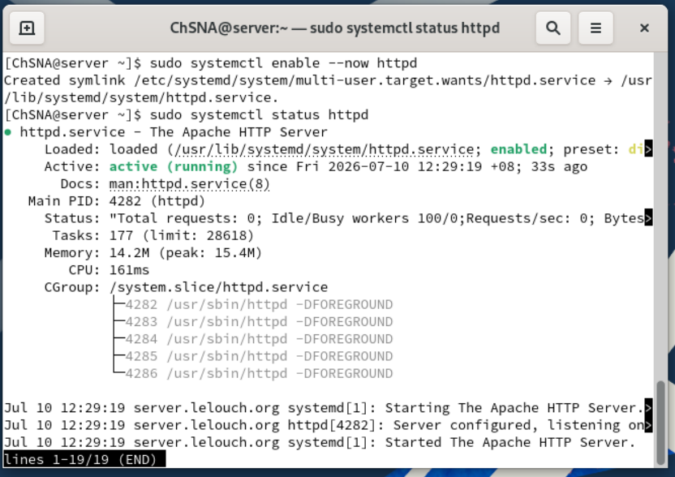

## HTTP Firewall Configuration

Apache HTTP traffic uses port `80/tcp`.

The HTTP service was allowed through the Rocky Linux firewall.

```bash
sudo firewall-cmd --permanent --add-service=http
sudo firewall-cmd --reload
sudo firewall-cmd --list-all
```

| Service | Port | Purpose |
|---|---|---|
| HTTP | 80/tcp | Allows web access using `http://` |

Opening the HTTP service allowed the Ubuntu client to access the Apache web server.

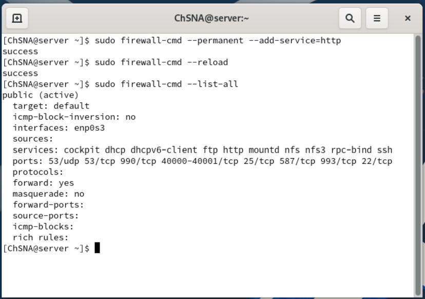

## Default Apache Page Test

Before creating a custom website, the default Apache test page was accessed from the Ubuntu client.

The browser was opened to:

```text
http://192.168.200.3
```

The default Rocky Linux Apache test page appeared successfully.

This confirmed that:

- Apache was installed correctly
- The `httpd` service was running
- The firewall allowed HTTP traffic
- Ubuntu could reach the Rocky web server

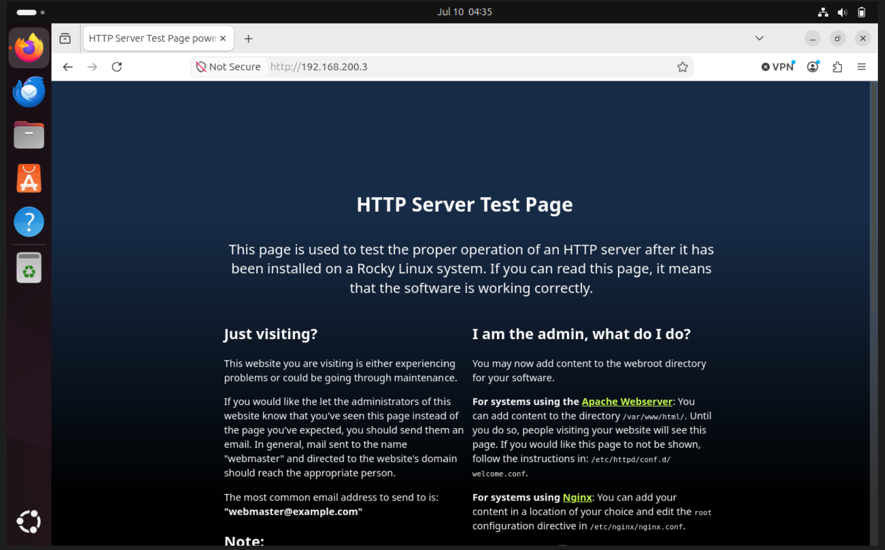

## Custom Website Directory

A custom web directory was created for the project website.

```bash
sudo mkdir -p /var/www/lelouch.org
```

The directory used for the website was:

```text
/var/www/lelouch.org
```

This directory became the `DocumentRoot` for the Apache VirtualHost.

The directory and `index.html` file were verified using:

```bash
sudo ls -ld /var/www/lelouch.org
sudo ls -l /var/www/lelouch.org
```

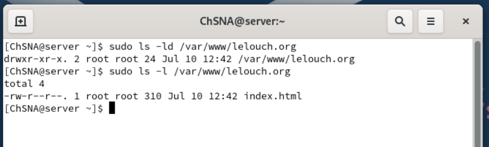

## First Custom HTML Page

A first simple custom HTML page was created to replace the default Apache test page.

```bash
sudo nano /var/www/lelouch.org/index.html
```

The first page included basic server information such as:

- Web server status
- Server hostname
- Server IP address

This was used as an initial test before improving the website design.

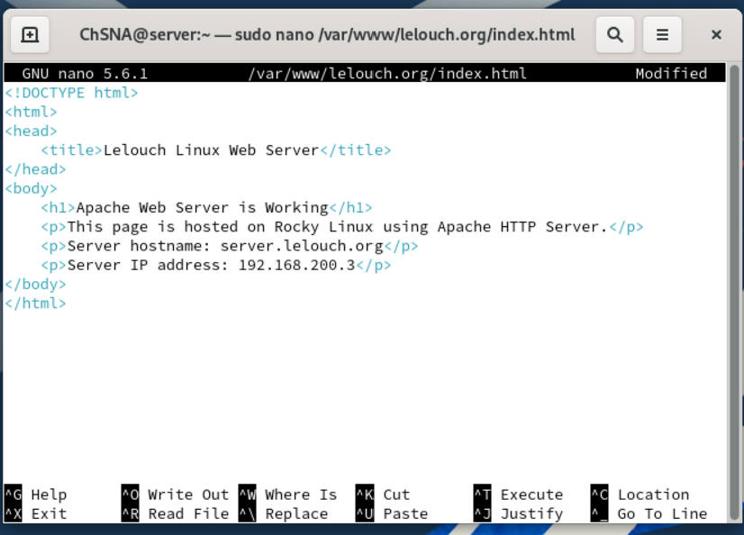

## HTTP VirtualHost Configuration

An Apache HTTP VirtualHost was created in:

```text
/etc/httpd/conf.d/lelouch.org.conf
```

The VirtualHost configuration was:

```apache
<VirtualHost *:80>
    ServerName server.lelouch.org
    ServerAlias 192.168.200.3

    DocumentRoot /var/www/lelouch.org

    ErrorLog /var/log/httpd/lelouch.org-error.log
    CustomLog /var/log/httpd/lelouch.org-access.log combined

    <Directory /var/www/lelouch.org>
        AllowOverride None
        Require all granted
    </Directory>
</VirtualHost>
```

Important settings:

| Setting | Purpose |
|---|---|
| `<VirtualHost *:80>` | Defines a website listening on HTTP port 80 |
| `ServerName` | Defines the main hostname for the site |
| `ServerAlias` | Allows the site to also be accessed using the server IP |
| `DocumentRoot` | Defines the folder containing the website files |
| `ErrorLog` | Stores error logs for this site |
| `CustomLog` | Stores access logs for this site |
| `Require all granted` | Allows clients to access the web directory |

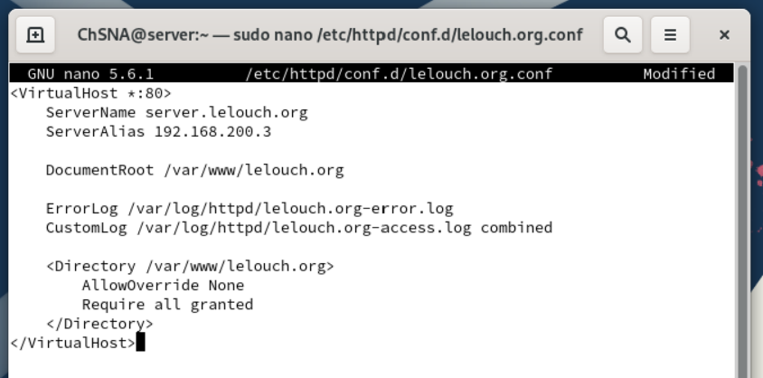

## Apache Configuration Test

After creating the HTTP VirtualHost, the Apache configuration was tested.

```bash
sudo apachectl configtest
sudo systemctl restart httpd
sudo systemctl status httpd --no-pager
```

The configuration test returned:

```text
Syntax OK
```

The `httpd` service was then restarted successfully.

This confirmed that the VirtualHost configuration did not break Apache.

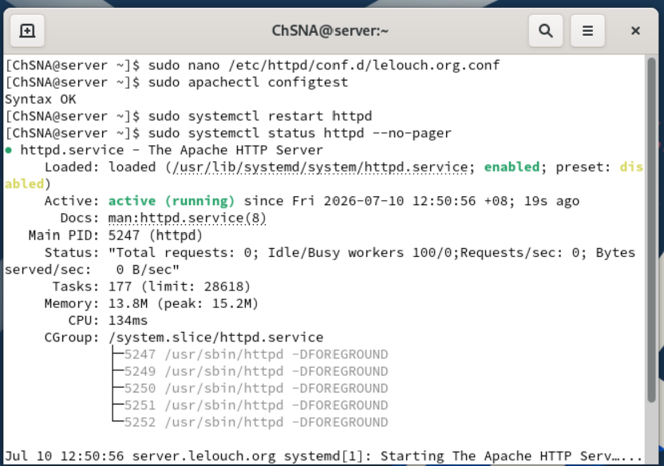

## First Custom Page Test

The first custom page was tested from the Ubuntu browser using:

```text
http://192.168.200.3
```

The page displayed the custom Apache test content instead of the default Apache test page.

This confirmed that Apache was now serving content from:

```text
/var/www/lelouch.org
```

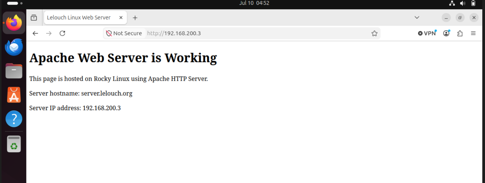

## SSL/TLS Certificate Generation

To enable HTTPS, a self-signed SSL/TLS certificate was generated for Apache.

```bash
sudo dnf install -y mod_ssl openssl
sudo mkdir -p /etc/ssl/apache

sudo openssl req -x509 -nodes -newkey rsa:2048 -days 365 \
-keyout /etc/ssl/apache/apache-selfsigned.key \
-out /etc/ssl/apache/apache-selfsigned.crt \
-subj "/C=MY/ST=KualaLumpur/L=KualaLumpur/O=LinuxLab/OU=Web/CN=server.lelouch.org"

sudo chmod 600 /etc/ssl/apache/apache-selfsigned.key
sudo ls -l /etc/ssl/apache/
```

The generated files were:

| File | Purpose |
|---|---|
| `apache-selfsigned.crt` | Public certificate used by Apache |
| `apache-selfsigned.key` | Private key used by Apache |

The private key was protected using `chmod 600`.

Because this is a local lab environment, a self-signed certificate is acceptable. In production, a certificate signed by a trusted certificate authority would normally be used.

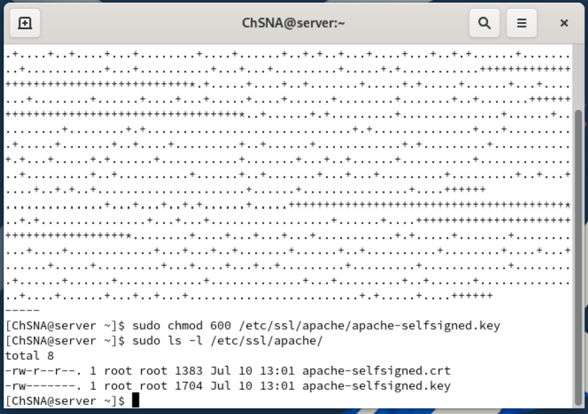

> The private key file was not uploaded to GitHub for security reasons.

## HTTPS VirtualHost Configuration

An HTTPS VirtualHost was created in:

```text
/etc/httpd/conf.d/00-lelouch-ssl.conf
```

The HTTPS VirtualHost configuration was:

```apache
<VirtualHost *:443>
    ServerName server.lelouch.org
    ServerAlias 192.168.200.3

    DocumentRoot /var/www/lelouch.org

    SSLEngine on
    SSLCertificateFile /etc/ssl/apache/apache-selfsigned.crt
    SSLCertificateKeyFile /etc/ssl/apache/apache-selfsigned.key

    ErrorLog /var/log/httpd/lelouch.org-ssl-error.log
    CustomLog /var/log/httpd/lelouch.org-ssl-access.log combined

    <Directory /var/www/lelouch.org>
        AllowOverride None
        Require all granted
    </Directory>
</VirtualHost>
```

Important settings:

| Setting | Purpose |
|---|---|
| `<VirtualHost *:443>` | Defines a website listening on HTTPS port 443 |
| `SSLEngine on` | Enables SSL/TLS for the site |
| `SSLCertificateFile` | Points to the public SSL certificate |
| `SSLCertificateKeyFile` | Points to the private SSL key |
| `DocumentRoot` | Uses the same website directory as HTTP |

The HTTPS VirtualHost uses `server.lelouch.org` as its main server name. This matches the DNS hostname used during the final browser test.

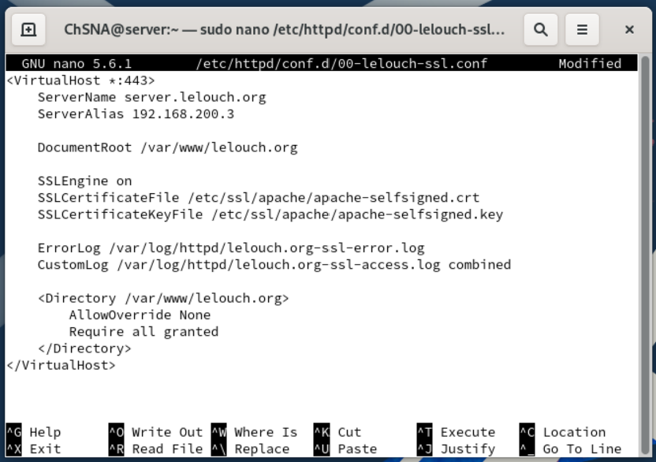

## SSL Default Configuration Fix

During HTTPS configuration, Apache initially failed because the default SSL configuration file still pointed to the default localhost certificate:

```text
/etc/pki/tls/certs/localhost.crt
```

The error occurred because that certificate file did not exist.

The issue was fixed by editing:

```text
/etc/httpd/conf.d/ssl.conf
```

and replacing the default certificate paths with the custom self-signed certificate paths:

```apache
SSLCertificateFile /etc/ssl/apache/apache-selfsigned.crt
SSLCertificateKeyFile /etc/ssl/apache/apache-selfsigned.key
```

This allowed Apache to use the certificate generated for this lab.

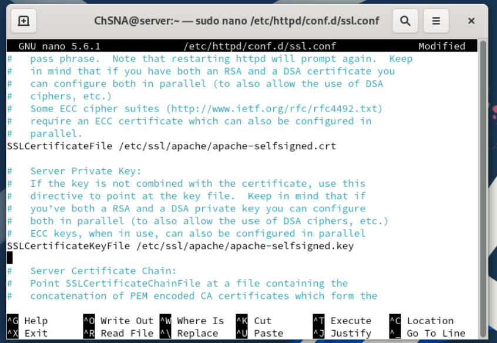

## HTTPS Service Verification

After fixing the SSL certificate path issue, the Apache configuration was tested again.

```bash
sudo apachectl configtest
sudo systemctl restart httpd
sudo systemctl status httpd
```

The configuration test returned:

```text
Syntax OK
```

The `httpd` service restarted successfully and was active.

This confirmed that Apache HTTPS configuration was working correctly.

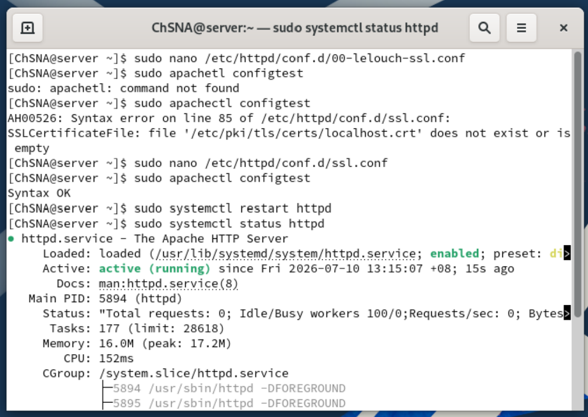

## HTTPS Firewall Configuration

HTTPS traffic uses port `443/tcp`.

The HTTPS service was allowed through the Rocky Linux firewall.

```bash
sudo firewall-cmd --permanent --add-service=https
sudo firewall-cmd --reload
sudo firewall-cmd --list-all
```

| Service | Port | Purpose |
|---|---|---|
| HTTPS | 443/tcp | Allows secure web access using `https://` |

The firewall output confirmed that both `http` and `https` were allowed.

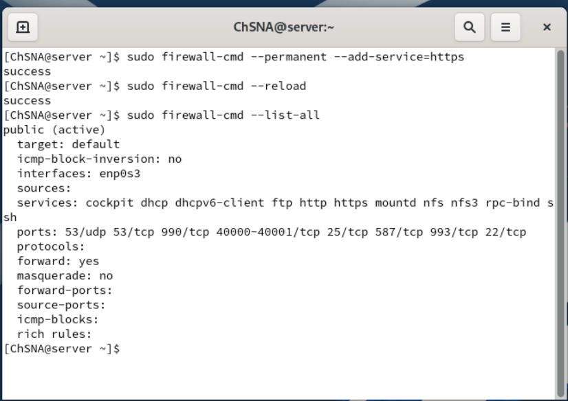

## Professional Website Update

After confirming that Apache and HTTPS were working, the website was improved to look more professional.

The final website presents the full Linux Network Services Lab and includes:

- Lab environment information
- Rocky Linux server details
- Ubuntu client details
- Completed services
- Security highlights
- Apache HTTPS status

The final website content is stored in:

```text
config/apache/index.html
```

This shows the actual web page hosted by Apache.

## Final HTTPS Website Test Using DNS

The final professional website was tested from the Ubuntu client using the local DNS hostname:

```text
https://server.lelouch.org
```

Using the DNS hostname is more realistic than using only the server IP address because the Apache VirtualHost was configured with:

```apache
ServerName server.lelouch.org
```

The SSL/TLS certificate was also generated for:

```text
CN=server.lelouch.org
```

This confirms that the Ubuntu client can access the Apache website using the local DNS name.

Firefox still displayed `Not Secure` because the certificate is self-signed. This is expected in a local lab environment.

The important result is that the website was reachable over HTTPS using the DNS hostname and Apache served the final professional web page correctly.

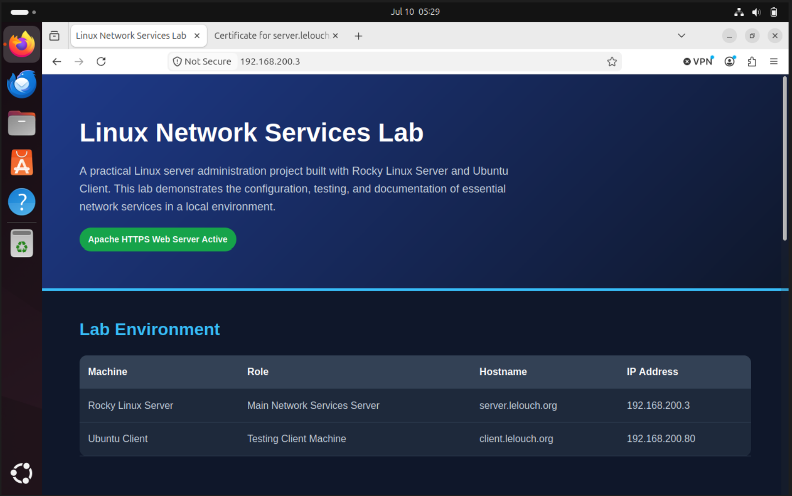

## Troubleshooting

During the HTTPS setup, Apache initially failed the configuration test because the default SSL configuration pointed to a missing certificate file:

```text
/etc/pki/tls/certs/localhost.crt
```

The issue was resolved by updating the SSL certificate paths in:

```text
/etc/httpd/conf.d/ssl.conf
```

to use the custom certificate and key:

```text
/etc/ssl/apache/apache-selfsigned.crt
/etc/ssl/apache/apache-selfsigned.key
```

Useful Apache troubleshooting commands include:

```bash
sudo systemctl status httpd
sudo journalctl -u httpd
sudo apachectl configtest
sudo httpd -t
sudo firewall-cmd --list-all
sudo ss -tulpn | grep httpd
```

These commands help verify:

- Apache service status
- Apache logs
- Configuration syntax
- Firewall rules
- Listening web ports

Common issues to check:

| Issue | Possible Cause |
|---|---|
| Page does not load | Apache not running or firewall blocking traffic |
| Default page still appears | VirtualHost not configured or wrong DocumentRoot |
| HTTPS fails | SSL certificate path incorrect |
| Browser shows Not Secure | Self-signed certificate is being used |
| Permission denied | Apache cannot read the web directory |
| DNS name does not load | Client DNS resolver is not pointing to the Rocky DNS server |

## Result

Apache Web Server was successfully configured on Rocky Linux.

The Ubuntu client was able to access the default Apache page, the first custom HTML page, and the final professional website.

HTTPS was configured using a self-signed SSL/TLS certificate.

The final professional website was successfully accessed from Ubuntu using HTTPS and the local DNS hostname `server.lelouch.org`.

This confirms that Apache HTTP and HTTPS hosting are working correctly in the local lab environment.
