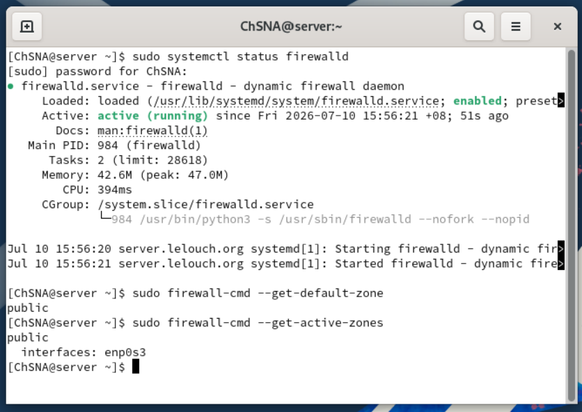
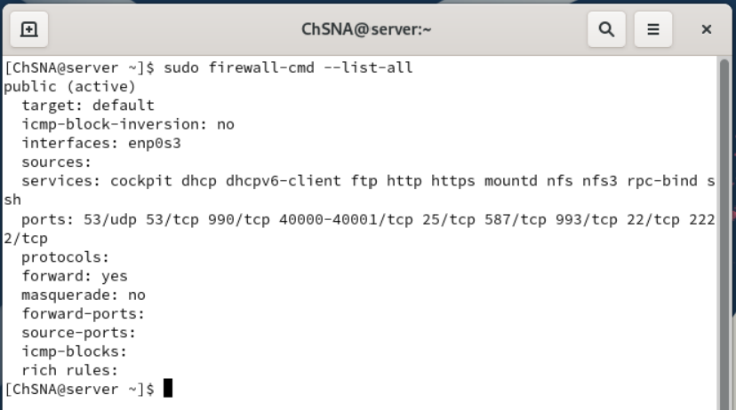

# Firewall Review with firewalld

## Objective

The objective of this section is to review and document the firewall configuration used on the Rocky Linux server.

Throughout this project, several services were configured on the server, including DNS, DHCP, FTP/FTPS, Mail, NFS, SSH, Apache, and Cowrie Honeypot.

Because these services need network access, the firewall must allow the correct ports while still blocking unnecessary traffic.

This section does not remove or block existing services. Instead, it reviews the current firewall configuration and explains why each important service or port is allowed.

## Why Firewall Review Is Important

A firewall is used to control network traffic going into or out of a system.

On this Rocky Linux server, `firewalld` is used to manage firewall rules.

The firewall is important because it helps to:

- Allow only required services
- Reduce unnecessary exposure
- Protect the server from unwanted connections
- Make network access more controlled
- Support secure system administration

In this lab, the firewall was configured progressively while each service was installed.

For example:

- DNS required port `53`
- Web services required ports `80` and `443`
- Mail required ports `25`, `587`, and `993`
- Cowrie Honeypot required port `2222`

At the end of the project, the firewall rules were reviewed to confirm that the opened ports match the services configured in the lab.

## Lab Information

| Machine | Role | Hostname | IP Address |
|---|---|---|---|
| Rocky Server | Main services server | server.lelouch.org | 192.168.200.3 |
| Ubuntu Client | Testing client machine | client.lelouch.org | 192.168.200.80 |

## Firewall Service Status

The first step was to verify that the firewall service was running.

Command used:

```bash
sudo systemctl status firewalld
```

This command checks the status of the `firewalld` service.

The output confirmed that the service was:

```text
active (running)
enabled
```

This means that the firewall is currently running and will also start automatically when the server boots.

This is important because firewall protection should not only work temporarily. It should remain active after a reboot.



## Default Firewall Zone

The default firewall zone was checked using:

```bash
sudo firewall-cmd --get-default-zone
```

The result was:

```text
public
```

In `firewalld`, a zone represents a level of trust for network connections.

The `public` zone is commonly used for networks where the server should not fully trust incoming connections.

Using the `public` zone is suitable for this lab because only selected services and ports are allowed.

## Active Firewall Zone and Interface

The active firewall zone and interface were checked using:

```bash
sudo firewall-cmd --get-active-zones
```

The result showed:

```text
public
  interfaces: enp0s3
```

This means that the main network interface `enp0s3` is attached to the `public` zone.

This is important because it confirms that the firewall rules in the `public` zone are being applied to the active network interface of the Rocky server.

In simple terms:

```text
Network interface enp0s3 → public zone → firewall rules applied
```

## Current Firewall Rules

The full firewall configuration was displayed using:

```bash
sudo firewall-cmd --list-all
```

This command shows:

- The active zone
- The network interface
- Allowed services
- Allowed ports
- Other firewall settings



The firewall output showed that the `public` zone is active and that the interface `enp0s3` is attached to it.

The output also showed the services and ports currently allowed by the firewall.

## Allowed Services

The following services were allowed in the firewall:

| Service | Purpose |
|---|---|
| `cockpit` | Rocky Linux web-based administration interface |
| `dhcp` | Allows DHCP server communication |
| `dhcpv6-client` | Default IPv6 DHCP client service |
| `ftp` | Allows standard FTP service |
| `http` | Allows Apache web traffic on port 80 |
| `https` | Allows Apache secure web traffic on port 443 |
| `mountd` | Required by NFS |
| `nfs` | Allows NFS file sharing |
| `nfs3` | Allows NFS version 3 support |
| `rpc-bind` | Required by NFS/RPC services |
| `ssh` | Allows SSH remote administration |

Some services, such as `cockpit` and `dhcpv6-client`, are present because they are common default or system-related services on Rocky Linux.

The most important services for this project are the ones linked to the configured lab services.

## Allowed Ports

The following ports were also allowed:

| Port | Protocol | Related Service | Purpose |
|---|---|---|---|
| `53/udp` | UDP | DNS | Allows DNS queries over UDP |
| `53/tcp` | TCP | DNS | Allows DNS queries and larger DNS responses over TCP |
| `990/tcp` | TCP | FTPS | Allows secure FTP over SSL/TLS |
| `40000-40001/tcp` | TCP | FTPS Passive Mode | Allows passive FTPS data connections |
| `25/tcp` | TCP | Mail / SMTP | Allows mail transfer through SMTP |
| `587/tcp` | TCP | Mail Submission | Allows authenticated mail sending |
| `993/tcp` | TCP | IMAPS | Allows secure mail retrieval |
| `22/tcp` | TCP | SSH | Allows remote administration |
| `2222/tcp` | TCP | Cowrie Honeypot | Allows access to the fake SSH honeypot |

## Firewall Rules by Project Service

### DNS Server

DNS was configured using BIND.

Required firewall rules:

```text
53/udp
53/tcp
```

DNS mainly uses UDP port `53`, but TCP port `53` is also useful for larger responses and zone-related operations.

In this project, DNS was required so the Ubuntu client could resolve names such as:

```text
server.lelouch.org
mail.lelouch.org
```

### DHCP Server

DHCP was configured on the Rocky server to assign an IP address automatically to the Ubuntu client.

Allowed service:

```text
dhcp
```

This allowed the Ubuntu client to receive network configuration from the Rocky server, including:

- IP address
- Subnet mask
- Default gateway
- DNS server

### FTP and FTPS Server

FTP and FTPS were configured using `vsftpd`.

Allowed firewall rules:

```text
ftp
990/tcp
40000-40001/tcp
```

The `ftp` service allows standard FTP access.

The `990/tcp` port was opened for secure FTP over SSL/TLS.

The passive port range `40000-40001/tcp` was opened because FTPS requires passive data connections for file transfers.

Without the passive port range, authentication might work, but file listing or file transfer could fail.

### Mail Server

The mail server was configured using Postfix and Dovecot.

Allowed firewall rules:

```text
25/tcp
587/tcp
993/tcp
```

Explanation:

| Port | Purpose |
|---|---|
| `25/tcp` | SMTP mail transfer |
| `587/tcp` | Authenticated mail submission |
| `993/tcp` | Secure IMAP mail access |

Thunderbird on Ubuntu used the mail services to send and receive email securely.

### NFS Server

NFS was configured to share files from Rocky to Ubuntu.

Allowed services:

```text
nfs
nfs3
mountd
rpc-bind
```

NFS depends on multiple services because it uses RPC-based communication.

These firewall services allowed the Ubuntu client to mount the shared NFS directory from the Rocky server.

### SSH Server

SSH was configured for remote administration.

Allowed rules:

```text
ssh
22/tcp
```

Port `22` is used by the real SSH service.

This allows the administrator to connect to the Rocky server remotely from the Ubuntu client.

In this project, the real SSH service remains separate from the Cowrie honeypot.

```text
Real SSH administration → port 22
Cowrie fake SSH honeypot → port 2222
```

### Apache Web Server

Apache was configured with HTTP and HTTPS.

Allowed services:

```text
http
https
```

These services allow access to:

```text
http://server.lelouch.org
https://server.lelouch.org
```

HTTP uses port `80`.

HTTPS uses port `443`.

HTTPS was secured using a self-signed SSL/TLS certificate.

### Cowrie SSH Honeypot

Cowrie was configured as a fake SSH honeypot.

Allowed firewall rule:

```text
2222/tcp
```

Cowrie listens on port `2222` instead of port `22`.

This avoids conflict with the real SSH service.

The Ubuntu client successfully connected to Cowrie using:

```bash
ssh admin@192.168.200.3 -p 2222
```

Cowrie captured the login attempt and commands in its logs.

## Services vs Ports in firewalld

In `firewalld`, access can be allowed in two main ways:

```text
service-based rules
port-based rules
```

A service-based rule uses a predefined service name, for example:

```text
http
https
ssh
ftp
nfs
```

A port-based rule allows a specific port directly, for example:

```text
53/tcp
587/tcp
993/tcp
2222/tcp
```

Both methods are valid.

In this project, both were used depending on the service.

For example:

- Apache was allowed using service names: `http` and `https`
- Cowrie was allowed using a direct port: `2222/tcp`
- Mail ports were allowed directly because they are specific to the mail configuration
- FTPS passive ports were allowed directly because they use a custom range

## Security Review

The firewall is active and configured to allow the services required by the lab.

This is acceptable because the Rocky server is intentionally hosting multiple services for learning and testing.

However, in a real production environment, the firewall should be more restrictive.

For example:

- Only required services should be exposed
- Unused services should be removed
- Administrative services should be limited to trusted IP addresses
- Honeypot services should be isolated and monitored carefully
- Public services should be separated from internal services where possible

In this lab, the server is inside a local VirtualBox network, so the exposure is limited to the lab environment.

## Result

The firewall review confirmed that:

- `firewalld` is installed and running
- `firewalld` is enabled at boot
- The default zone is `public`
- The active network interface `enp0s3` is assigned to the `public` zone
- Required services and ports are allowed
- Each important open port is linked to a configured service in the project

The firewall configuration supports all completed services in the lab while keeping the rules documented and understandable.
