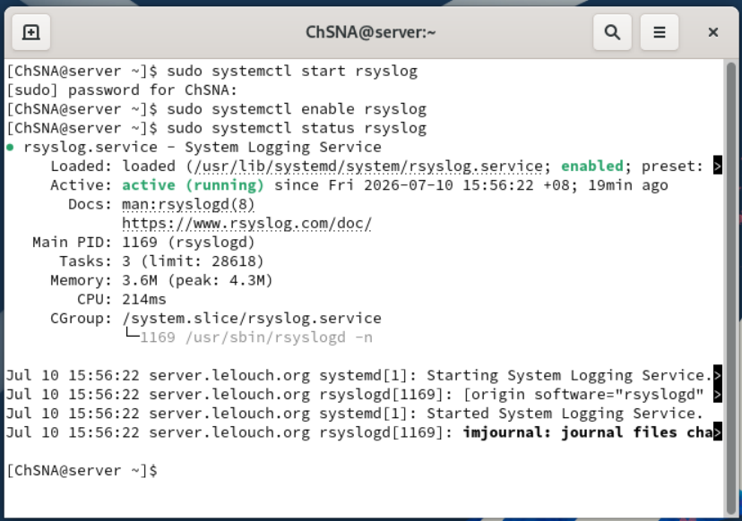
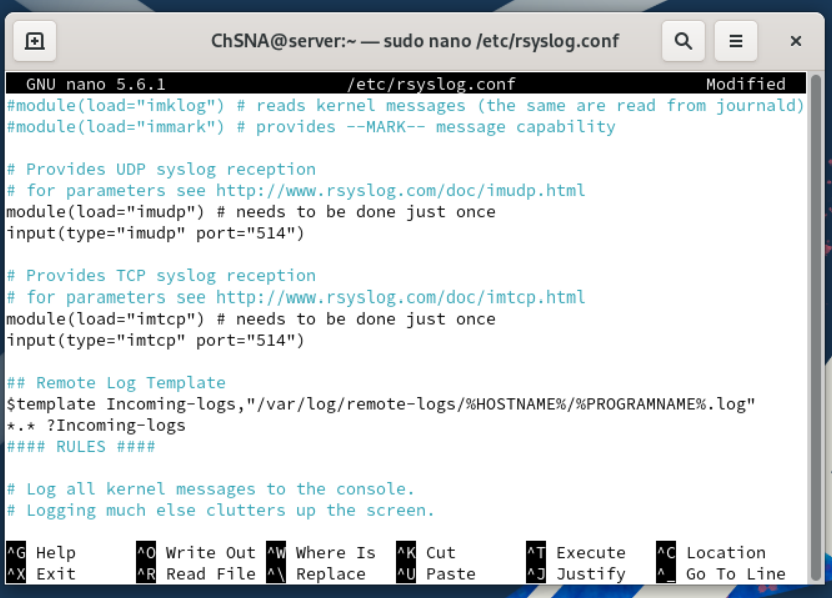
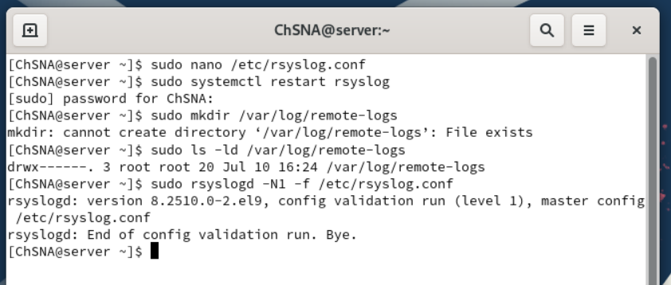
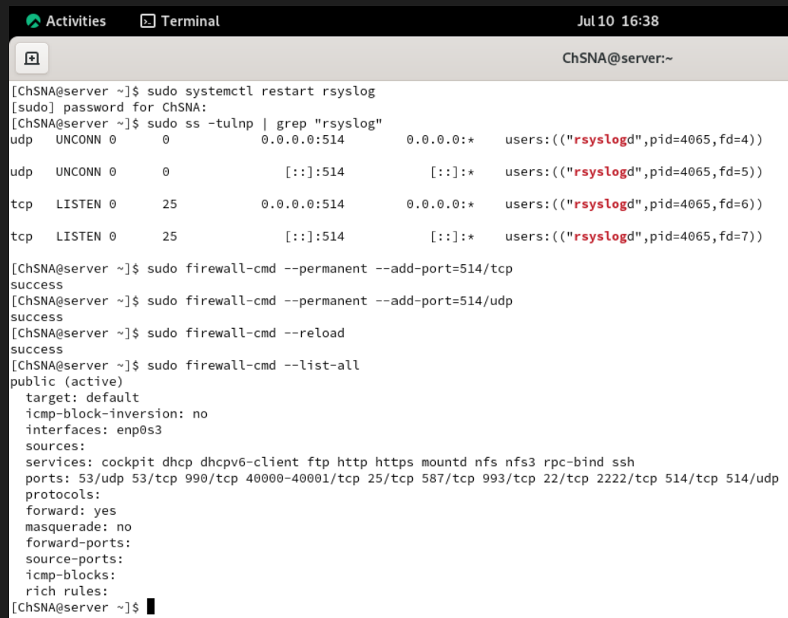
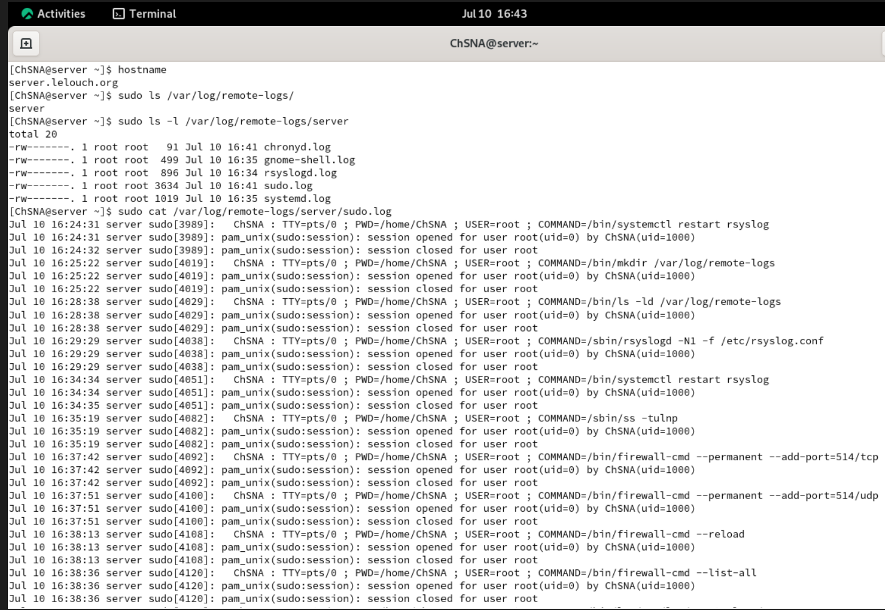
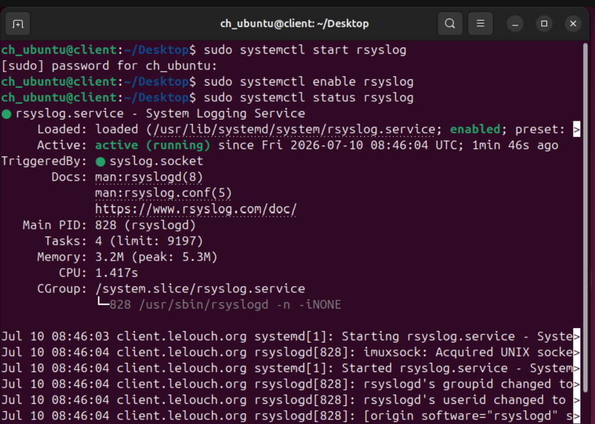
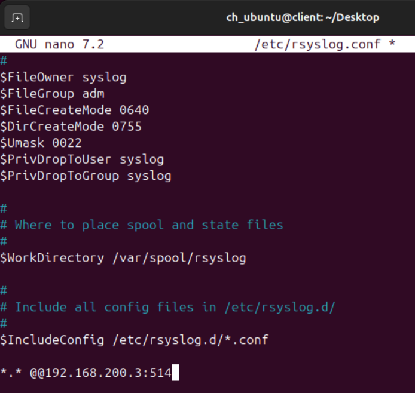
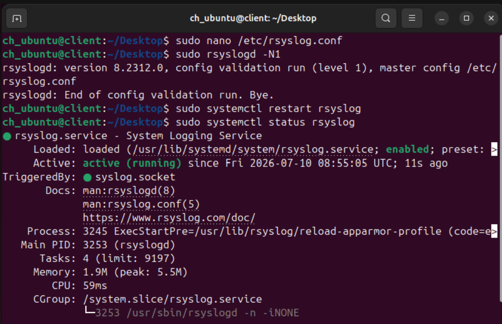
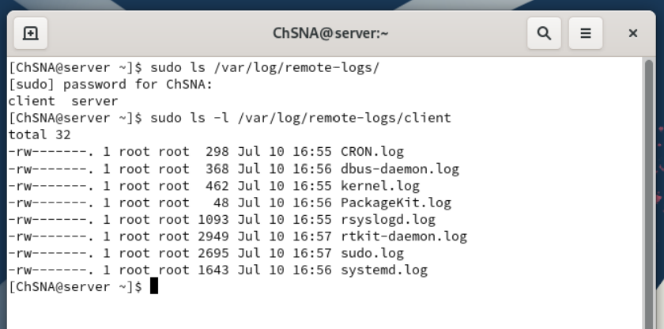
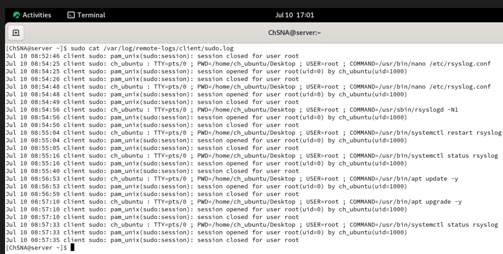

# Syslog Server Configuration with rsyslog

## Objective

The objective of this section is to configure a centralized Syslog server using `rsyslog`.

In this lab, the Rocky Linux server was configured as the centralized Syslog server, while the Ubuntu client was configured to forward its logs to Rocky.

Centralized logging is useful because it allows logs from multiple systems to be collected and reviewed from one location.

This helps with:

- System monitoring
- Troubleshooting
- Security investigation
- Tracking administrative activity
- Reviewing logs from multiple machines in one place

## Lab Information

| Machine | Role | Hostname | IP Address |
|---|---|---|---|
| Rocky Server | Central Syslog Server | server.lelouch.org | 192.168.200.3 |
| Ubuntu Client | Syslog Client | client.lelouch.org | 192.168.200.80 |

## Syslog Overview

The Syslog setup works like this:

```text
Ubuntu Client → sends logs to port 514 → Rocky Syslog Server → stores logs in /var/log/remote-logs/
```

In this project:

```text
Rocky Server  = receives and stores logs
Ubuntu Client = forwards logs to Rocky
Port used     = 514/tcp and 514/udp
```

The final result is that Rocky stores logs from both machines:

```text
/var/log/remote-logs/server/
/var/log/remote-logs/client/
```

The `server` folder contains local logs from Rocky.

The `client` folder contains logs forwarded from Ubuntu.

## Configuration Files

The important Syslog configuration files are stored in the `config/syslog/` folder.

| File | Purpose |
|---|---|
| [rocky-rsyslog-server.conf](../config/syslog/rocky-rsyslog-server.conf) | Rocky server configuration for receiving remote logs |
| [ubuntu-rsyslog-client.conf](../config/syslog/ubuntu-rsyslog-client.conf) | Ubuntu client configuration for forwarding logs to Rocky |

## Rocky Server: rsyslog Service Status

The first step was to verify that `rsyslog` was running on the Rocky server.

Commands used:

```bash
sudo systemctl start rsyslog
sudo systemctl enable rsyslog
sudo systemctl status rsyslog
```

Explanation:

| Command | Purpose |
|---|---|
| `start` | Starts the rsyslog service immediately |
| `enable` | Allows rsyslog to start automatically after reboot |
| `status` | Verifies that rsyslog is active and running |

The service status confirmed that `rsyslog` was active and enabled.



## Rocky Server: Receiving Remote Logs

The Rocky server was configured to receive logs using both UDP and TCP on port `514`.

The configuration was added in:

```text
/etc/rsyslog.conf
```

The remote log reception configuration was:

```conf
module(load="imudp")
input(type="imudp" port="514")

module(load="imtcp")
input(type="imtcp" port="514")
```

Explanation:

| Line | Purpose |
|---|---|
| `module(load="imudp")` | Enables UDP syslog reception |
| `input(type="imudp" port="514")` | Allows rsyslog to listen for UDP logs on port 514 |
| `module(load="imtcp")` | Enables TCP syslog reception |
| `input(type="imtcp" port="514")` | Allows rsyslog to listen for TCP logs on port 514 |

Both TCP and UDP were enabled because Syslog commonly supports both transport methods.

TCP is more reliable, while UDP is simpler and commonly used in many logging environments.

## Rocky Server: Remote Log Storage Template

A template was added to control where incoming logs are saved.

Configuration used:

```conf
$template Incoming-logs,"/var/log/remote-logs/%HOSTNAME%/%PROGRAMNAME%.log"
*.* ?Incoming-logs
```

Explanation:

| Part | Purpose |
|---|---|
| `$template Incoming-logs` | Creates a template named `Incoming-logs` |
| `/var/log/remote-logs/` | Main folder where remote logs are stored |
| `%HOSTNAME%` | Creates a separate folder based on the sending machine hostname |
| `%PROGRAMNAME%` | Creates separate log files based on the program name |
| `*.* ?Incoming-logs` | Sends all log messages to the template |

This structure makes the logs easier to read because each client and program has its own location.

Example structure:

```text
/var/log/remote-logs/client/sudo.log
/var/log/remote-logs/client/systemd.log
/var/log/remote-logs/server/sudo.log
```



## Rocky Server: Configuration Validation

After editing the rsyslog configuration file, the configuration was validated using:

```bash
sudo rsyslogd -N1 -f /etc/rsyslog.conf
```

This command checks the rsyslog configuration before relying on it.

It helps detect syntax errors before the service is restarted.

The validation completed successfully.



## Rocky Server: Port 514 and Firewall Configuration

After restarting rsyslog, the server was checked to confirm that it was listening on port `514`.

Command used:

```bash
sudo ss -tulnp | grep "rsyslog"
```

The output showed that `rsyslog` was listening on:

```text
514/tcp
514/udp
```

The firewall was then configured to allow Syslog traffic.

Commands used:

```bash
sudo firewall-cmd --permanent --add-port=514/tcp
sudo firewall-cmd --permanent --add-port=514/udp
sudo firewall-cmd --reload
sudo firewall-cmd --list-all
```

Explanation:

| Port | Purpose |
|---|---|
| `514/tcp` | Allows Syslog messages over TCP |
| `514/udp` | Allows Syslog messages over UDP |

The firewall output confirmed that both ports were allowed.



## Rocky Server: Local Log Storage

After applying the rsyslog template, Rocky also stored its own local logs under:

```text
/var/log/remote-logs/server/
```

This happened because the rule:

```conf
*.* ?Incoming-logs
```

matches all logs, including local logs generated by the Rocky server.

The following command was used to view the local log folder:

```bash
sudo ls /var/log/remote-logs/
sudo ls -l /var/log/remote-logs/server
sudo cat /var/log/remote-logs/server/sudo.log
```

The output showed local Rocky logs such as:

```text
sudo.log
systemd.log
rsyslogd.log
chronyd.log
```

This confirms that the template was working and organizing logs by hostname and program name.



## Ubuntu Client: rsyslog Service Status

On the Ubuntu client, the `rsyslog` service was started, enabled, and checked.

Commands used:

```bash
sudo systemctl start rsyslog
sudo systemctl enable rsyslog
sudo systemctl status rsyslog
```

The output confirmed that rsyslog was active and running on Ubuntu.

This is necessary because Ubuntu must have rsyslog running before it can forward logs to Rocky.



## Ubuntu Client: Forwarding Logs to Rocky

Ubuntu was configured to forward logs to the Rocky server.

The forwarding rule was added to:

```text
/etc/rsyslog.conf
```

Configuration used:

```conf
*.* @@192.168.200.3:514
```

Explanation:

| Part | Purpose |
|---|---|
| `*.*` | Sends all log facilities and priorities |
| `@@` | Uses TCP forwarding |
| `192.168.200.3` | Rocky Syslog server IP address |
| `514` | Syslog port |

The difference between `@` and `@@` is:

| Symbol | Meaning |
|---|---|
| `@` | Sends logs using UDP |
| `@@` | Sends logs using TCP |

TCP was used because it is more reliable than UDP.



## Ubuntu Client: Configuration Validation and Restart

After editing the Ubuntu rsyslog configuration, the configuration was validated using:

```bash
sudo rsyslogd -N1
```

Then rsyslog was restarted:

```bash
sudo systemctl restart rsyslog
sudo systemctl status rsyslog
```

Explanation:

| Command | Purpose |
|---|---|
| `rsyslogd -N1` | Validates the rsyslog configuration |
| `restart` | Applies the forwarding rule |
| `status` | Confirms that rsyslog is still running |

The output confirmed that the Ubuntu rsyslog service was active after the restart.



## Rocky Server: Remote Client Log Directory

After Ubuntu was configured to forward logs, the Rocky server created a new folder for the Ubuntu client.

Commands used on Rocky:

```bash
sudo ls /var/log/remote-logs/
sudo ls -l /var/log/remote-logs/client
```

The output showed two folders:

```text
client
server
```

Explanation:

| Folder | Meaning |
|---|---|
| `server` | Logs generated locally by Rocky |
| `client` | Logs received remotely from Ubuntu |

The `client` folder proves that Rocky received logs from the Ubuntu machine.



## Rocky Server: Received Ubuntu sudo Logs

To verify that logs from Ubuntu were actually received, the `sudo.log` file inside the client folder was opened.

Command used:

```bash
sudo cat /var/log/remote-logs/client/sudo.log
```

The output showed `sudo` commands generated on Ubuntu, such as:

```text
nano /etc/rsyslog.conf
rsyslogd -N1
systemctl restart rsyslog
apt update -y
apt upgrade -y
systemctl status rsyslog
```

This confirms that Rocky successfully received and stored logs from the Ubuntu client.

This is the most important proof that centralized logging works.



## Troubleshooting

### Issue 1: Remote log directory already existed

When creating the remote log directory, the system showed that the folder already existed.

This was not a real problem.

The folder:

```text
/var/log/remote-logs/
```

already existed because rsyslog had already created or used it after applying the template.

The important point is that the directory existed and was usable.

### Issue 2: Understanding local logs vs remote logs

At first, the `server` folder appeared inside:

```text
/var/log/remote-logs/
```

This could be confusing because the goal was to receive logs from Ubuntu.

However, this was expected because the rule:

```conf
*.* ?Incoming-logs
```

also stores local Rocky logs using the same template.

The final proof came later when the `client` folder appeared.

```text
/var/log/remote-logs/client/
```

This confirmed that logs from Ubuntu were received by Rocky.

## Security Notes

Centralized logging is useful for security because logs are stored outside the client machine.

If a client system has a problem, its logs can still be reviewed from the log server.

This can help with:

- Reviewing sudo activity
- Investigating failed services
- Tracking system changes
- Monitoring suspicious behavior
- Supporting incident response

In this lab, the Syslog server is only used inside the local VirtualBox network.

It is not exposed to the public Internet.

## Result

The Syslog server configuration was successful.

Rocky Linux was configured as a centralized rsyslog server listening on port `514`.

Ubuntu was configured as a Syslog client and forwarded logs to Rocky using TCP.

Rocky successfully created a client log directory and stored Ubuntu logs under:

```text
/var/log/remote-logs/client/
```

The received `sudo.log` confirmed that logs generated on Ubuntu were successfully collected by the Rocky Syslog server.
